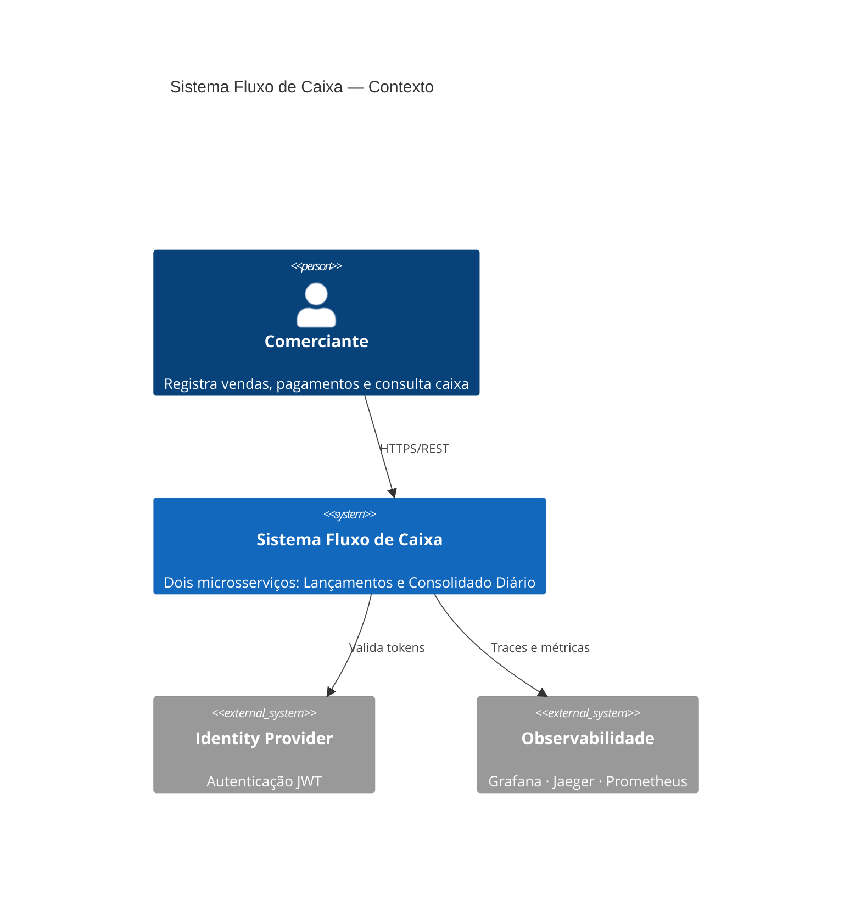
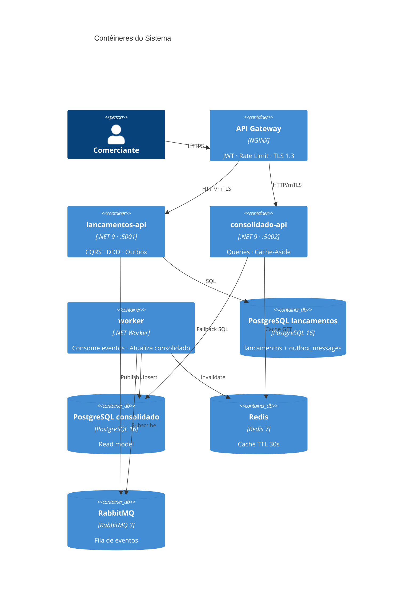
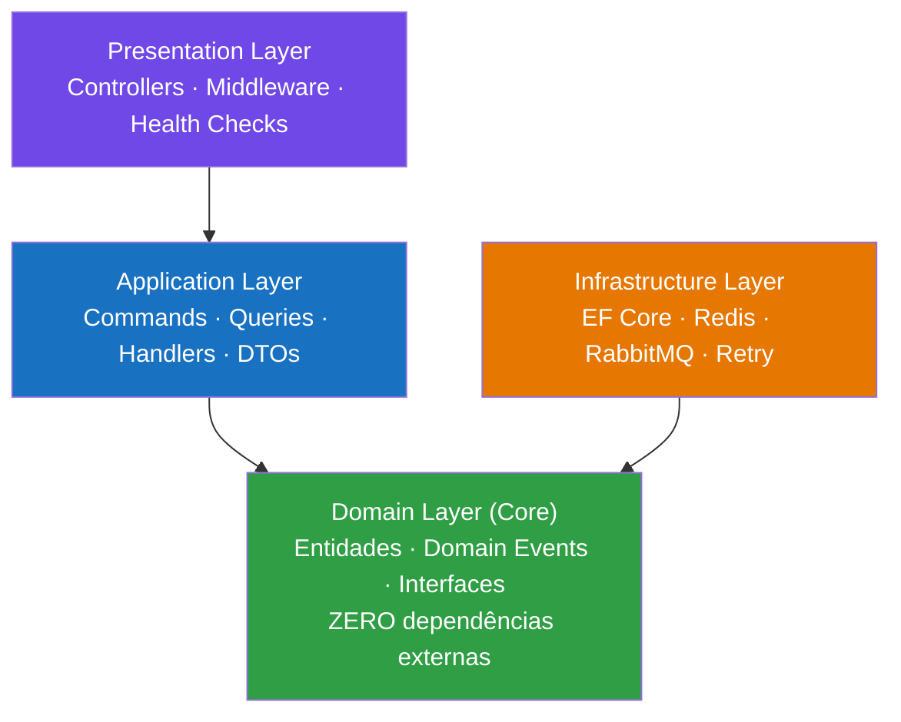
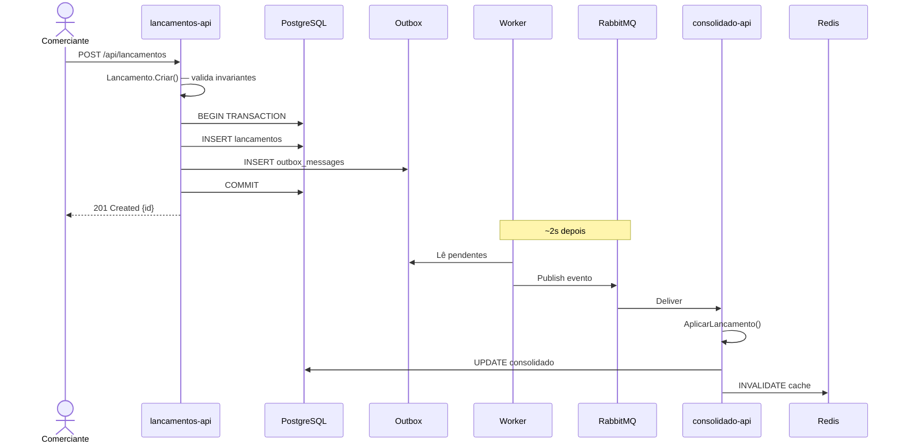
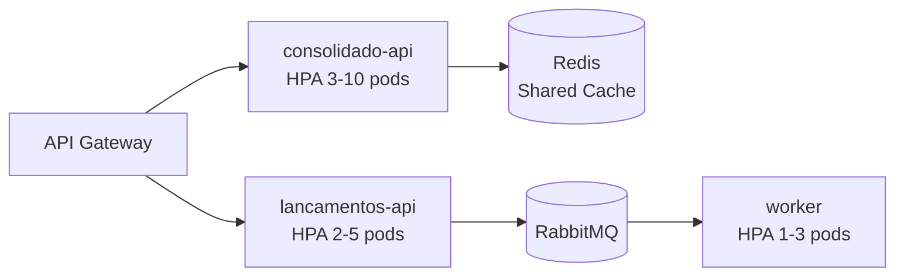
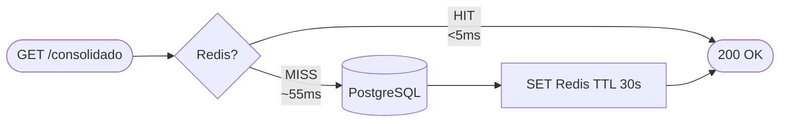
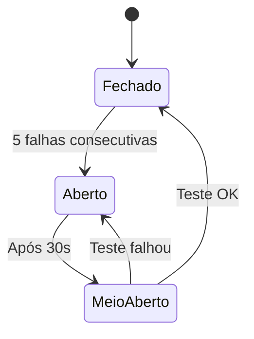
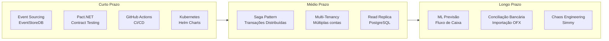

# Desafio Arquiteto de Soluções — Banco Carrefour: Sistema de Fluxo de Caixa

> **Candidato:** Paulo Marne
> **Data:** Maio de 2026
> **Repositório:** [fluxo-de-caixa-banco-carrefour](fluxo-de-caixa-banco-carrefour/)

---

## Visão Geral da Solução

A solução foi projetada com base em **Clean Architecture**, **Domain-Driven Design (DDD)**, **CQRS** e **Event-Driven Architecture** para atender a dois requisitos não-funcionais críticos que ditam toda a arquitetura:

| Requisito | Solução |
|---|---|
| Lançamentos **não podem cair** se o consolidado cair | Microsserviços independentes + mensageria assíncrona |
| Consolidado suporta **50 rps** com máx. 5% de perda | Cache Redis TTL 30s + projeção pré-computada |

---

## Contexto de Sistema



---

## Arquitetura de Contêineres



---

## Clean Architecture — Camadas



---

## Fluxo de Registro de Lançamento



---

## Requisitos Não Funcionais

### Escalabilidade



### Cache-Aside para 50 rps



### Tolerância a Falhas



---

## Testes e Qualidade

| Suite | Casos | Cobertura |
|---|---|---|
| Domínio — `LancamentoTests` | 14 | Invariantes, Domain Events, cancelamento, edge cases |
| Domínio — `ConsolidadoDiarioTests` | 8 | Saldo, acumulação, contas diferentes, datas |
| Application — `CriarLancamentoCommandTests` | 6 | Handler, repo, evento, falhas |
| Application — `CancelarLancamentoCommandTests` | 3 | Cancelamento, inexistente, evento |
| Application — `ObterConsolidadoDiarioQueryTests` | 5 | Cache HIT/MISS, zeros, saldo correto |
| **Total** | **36** | |

```bash
dotnet test --collect:"XPlat Code Coverage"
```

---

## Tecnologias Utilizadas

| Categoria | Tecnologia | Justificativa |
|---|---|---|
| **Runtime** | .NET 9 / C# | ~15% menos alocações HTTP vs .NET 8, melhor startup em containers |
| **APIs** | ASP.NET Core Minimal API | Menor overhead de reflection vs MVC Controller |
| **Mensageria** | RabbitMQ → Azure Service Bus | Desacoplamento assíncrono entre microsserviços |
| **Cache** | IMemoryCache → Redis 7 | 50 rps = 180k queries/h sem cache; Redis suporta >10k rps |
| **Banco** | In-Memory → PostgreSQL 16 | ACID em produção, sem lock contention com CQRS |
| **Testes** | xUnit + FluentAssertions + Moq | Legibilidade e mocking preciso de contratos |
| **Containers** | Docker Compose → AKS | Portabilidade e escalonamento horizontal |
| **Observabilidade** | OpenTelemetry + Grafana + Jaeger | Traces distribuídos end-to-end |

---

## Como Rodar Localmente

```bash
# Clone
git clone <url>
cd fluxo-de-caixa-banco-carrefour

# Docker Compose (recomendado — stack completa)
docker compose up --build

# Acesse:
# http://localhost:5001/swagger  → API Lançamentos
# http://localhost:5002/swagger  → API Consolidado
# http://localhost:3000          → Grafana
# http://localhost:16686         → Jaeger

# Apenas .NET (sem Docker)
dotnet run --project src/Presentation/ApiLancamentos &
dotnet run --project src/Presentation/ApiConsolidado &
dotnet run --project src/WorkerServices/ProcessadorEventos

# Testes
dotnet test
```

---

## Próximos Passos e Evoluções Futuras



---

**Documentação detalhada:** [solution_architecture.md](fluxo-de-caixa-banco-carrefour/docs/solution_architecture.md)

**Autor:** Paulo Marne · Maio de 2026
