# Arquitetura de Soluções — Controle de Fluxo de Caixa

> **Desafio:** Arquiteto de Soluções — Banco Carrefour · 2026
> **Stack:** .NET 9 · PostgreSQL · Redis · RabbitMQ · Docker · CQRS · DDD · Clean Architecture · Event-Driven

---

## TL;DR — Decisões que guiam toda a arquitetura

Os dois requisitos não-funcionais críticos ditam cada escolha arquitetural:

| Requisito | Meta | Solução |
|---|---|---|
| **RNF-01** Lançamentos não caem se o consolidado cair | 100% isolamento | Microsserviços independentes + mensageria assíncrona |
| **RNF-02** Consolidado suporta 50 rps com máx. 5% perda | P99 < 200ms | Cache Redis TTL 30s + projeção pré-computada |
| **RNF-03** Atomicidade entre persistência e evento | Zero perda de dados | Outbox Pattern (mesma transação) |

---

## Índice

1. [Visão AS-IS / TO-BE](#visão-as-is--to-be)
2. [Domínios Funcionais (DDD)](#domínios-funcionais-ddd)
3. [Arquitetura Alvo — C4 Container](#arquitetura-alvo--c4-container)
4. [Camadas Internas — Clean Architecture](#camadas-internas--clean-architecture)
5. [Fluxos de Dados Críticos](#fluxos-de-dados-críticos)
6. [Requisitos Não Funcionais](#requisitos-não-funcionais)
7. [ADRs — Decisões Arquiteturais](#adrs--decisões-arquiteturais)
8. [Estrutura do Projeto](#estrutura-do-projeto)
9. [Observabilidade](#observabilidade)
10. [Segurança](#segurança)
11. [Arquitetura de Transição](#arquitetura-de-transição)
12. [Testes e Qualidade](#testes-e-qualidade)
13. [Kubernetes e Infraestrutura](#kubernetes-e-infraestrutura)
14. [Estimativa de Custos Azure](#estimativa-de-custos-azure)
15. [Evoluções Futuras](#evoluções-futuras)
16. [Como Rodar Localmente](#como-rodar-localmente)

---

## Visão AS-IS / TO-BE

### AS-IS — Situação Atual (Sistema Legado)

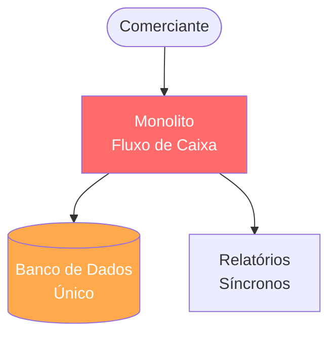

**Problemas identificados:**
- Acoplamento total: falha em qualquer módulo derruba o sistema inteiro
- Relatórios síncronos competem com lançamentos por recursos do banco
- Impossível escalar consolidado independentemente dos lançamentos
- Zero separação de contextos de domínio

### TO-BE — Arquitetura Alvo

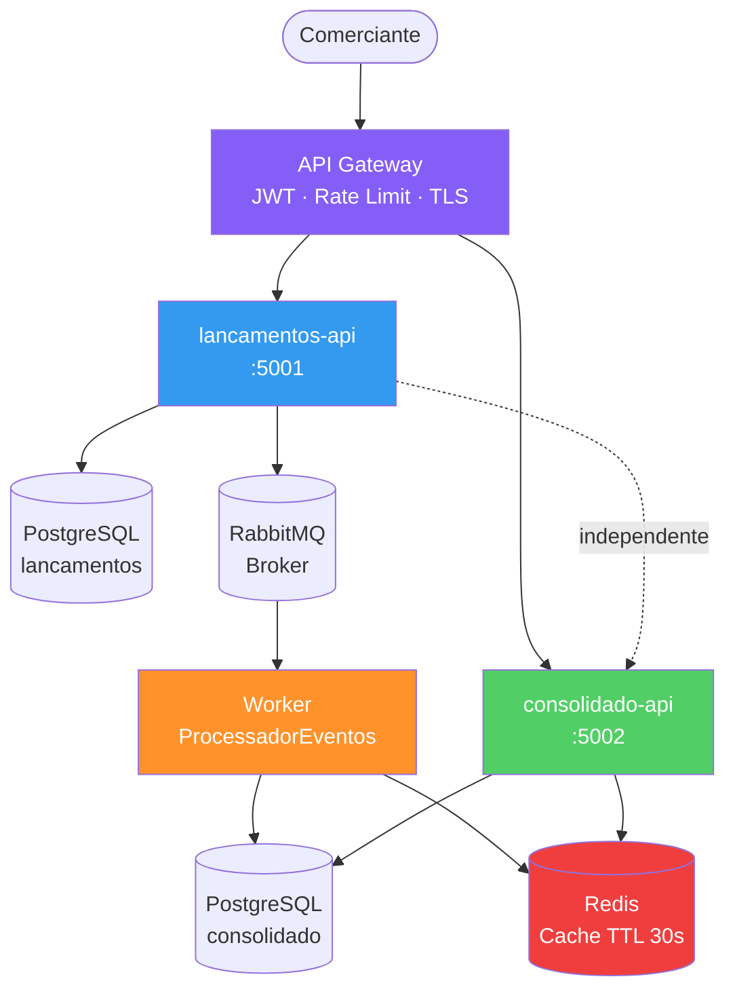

**Ganhos mensuráveis:**
| Aspecto | AS-IS | TO-BE |
|---|---|---|
| Isolamento de falhas | Nenhum | Total (RNF-01 atendido) |
| Throughput consolidado | ~200 rps (sem cache) | >10.000 rps (cache hit) |
| Latência consolidado | ~50ms | <5ms (cache hit) |
| Escalabilidade | Vertical apenas | Horizontal independente |
| Observabilidade | Logs básicos | Traces distribuídos + métricas |

---

## Domínios Funcionais (DDD)

### Bounded Contexts

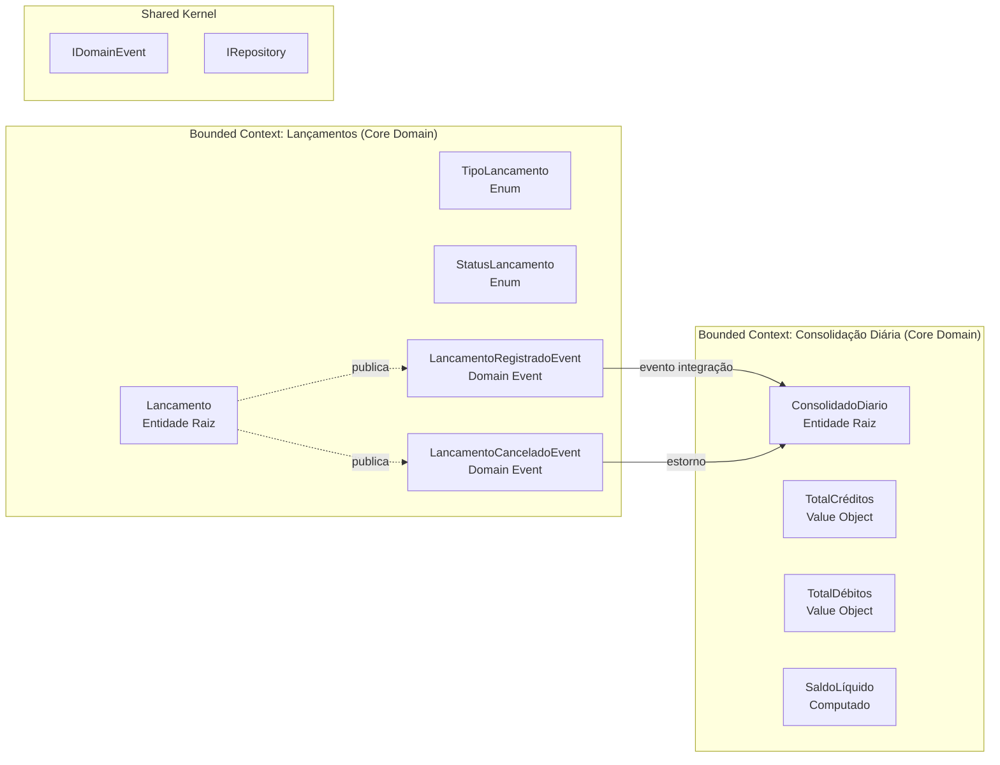

### Linguagem Ubíqua

| Termo | Definição no Domínio |
|---|---|
| **Lançamento** | Registro financeiro de entrada ou saída na conta do comerciante |
| **Débito** | Saída de caixa — reduz o saldo disponível |
| **Crédito** | Entrada de caixa — aumenta o saldo disponível |
| **Consolidado Diário** | Projeção calculada do saldo total de um dia |
| **Saldo Líquido** | TotalCréditos − TotalDébitos de um dia |
| **Estorno** | Reversão aplicada ao consolidado quando lançamento é cancelado |

### Capacidades de Negócio

| Capacidade | Domínio | Criticidade |
|---|---|---|
| Registrar lançamento (débito/crédito) | Lançamentos | Crítica |
| Cancelar lançamento (soft-delete) | Lançamentos | Alta |
| Consultar lançamentos por data | Lançamentos | Alta |
| Consultar saldo consolidado do dia | Consolidação | Crítica |
| Reprocessar consolidado (admin) | Consolidação | Média |

---

## Arquitetura Alvo — C4 Container

### Nível de Contexto (C4-L1)

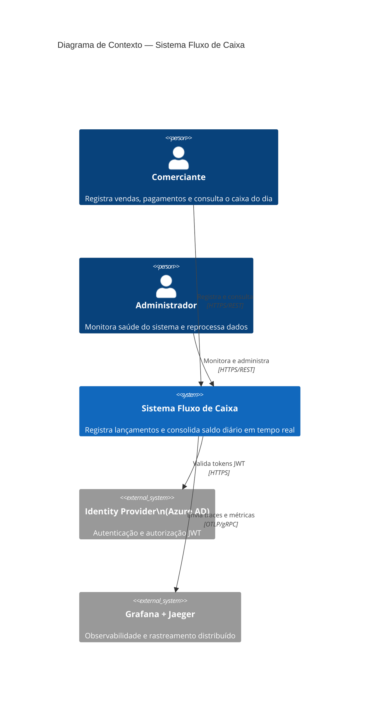

### Nível de Contêiner (C4-L2)

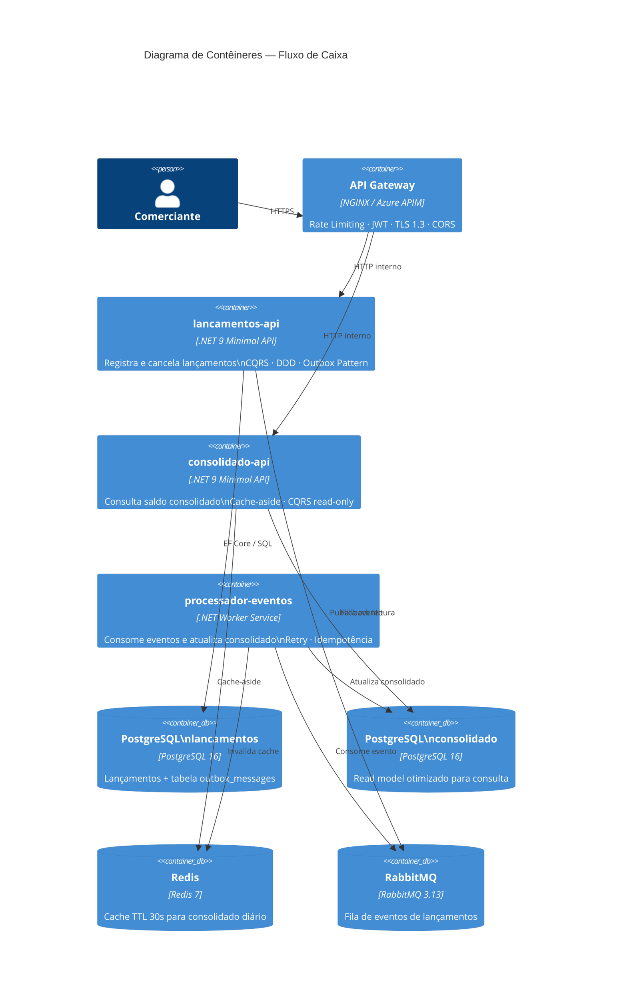

---

## Camadas Internas — Clean Architecture

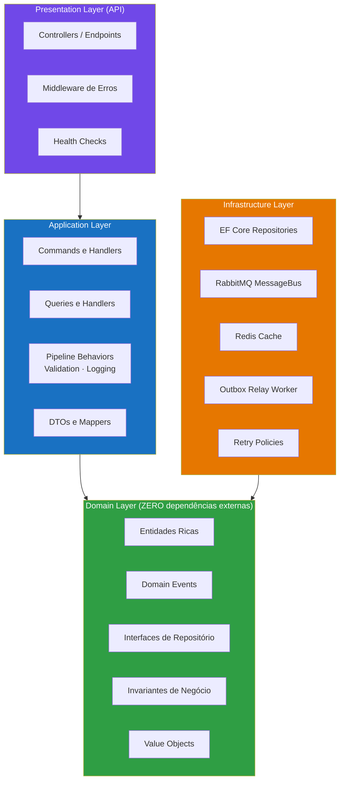

**Regra de ouro:** as setas de dependência apontam sempre para dentro (Dependency Inversion Principle). O domínio não conhece nenhuma tecnologia externa.

### Interfaces do Domínio (contratos)

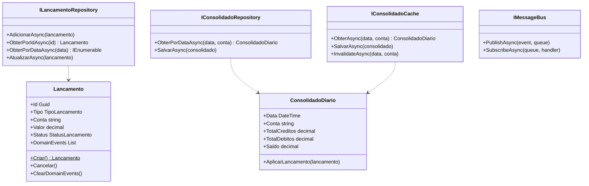

---

## Fluxos de Dados Críticos

### Fluxo 1 — Registrar Lançamento (caminho feliz)

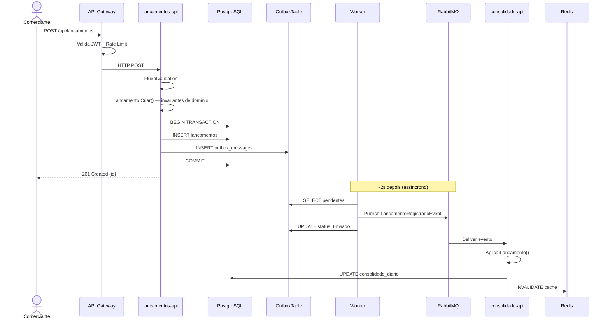

### Fluxo 2 — Consultar Consolidado (50 rps, cache-aside)

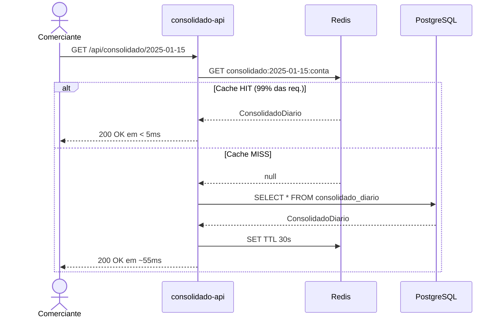

### Fluxo 3 — Cancelar Lançamento

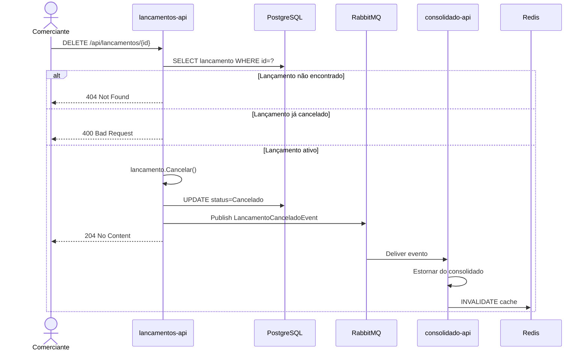

---

## Requisitos Não Funcionais

### Escalabilidade

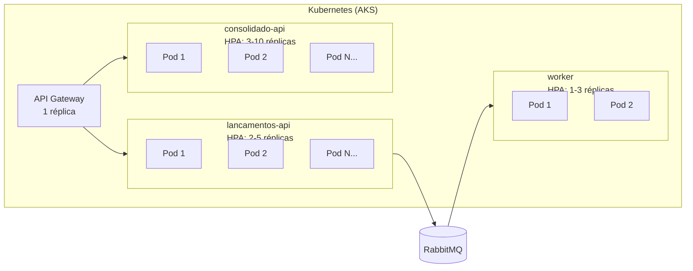

**Estratégias:**
- **HPA (Horizontal Pod Autoscaler):** escala baseado em CPU e métricas customizadas (mensagens na fila)
- **Stateless:** todas as instâncias são intercambiáveis — sessão nunca em memória local
- **Redis externo:** cache compartilhado entre todas as réplicas do consolidado-api
- **Connection Pool:** EF Core pool de conexões configurado por instância
- **Scale-to-zero:** consolidado-api escala para zero em períodos de baixo tráfego

### Controle de Concorrência

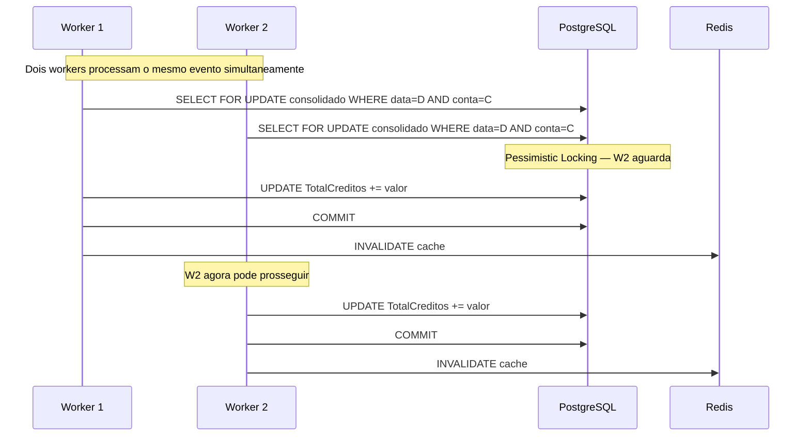

**Mecanismos implementados:**
- `ConcurrentDictionary` no repositório in-memory (thread-safe)
- `SELECT FOR UPDATE` no PostgreSQL para updates do consolidado
- Idempotência via `MessageId` único para evitar processamento duplicado
- Outbox Pattern garante exactly-once semantics na publicação

### Cache Strategy

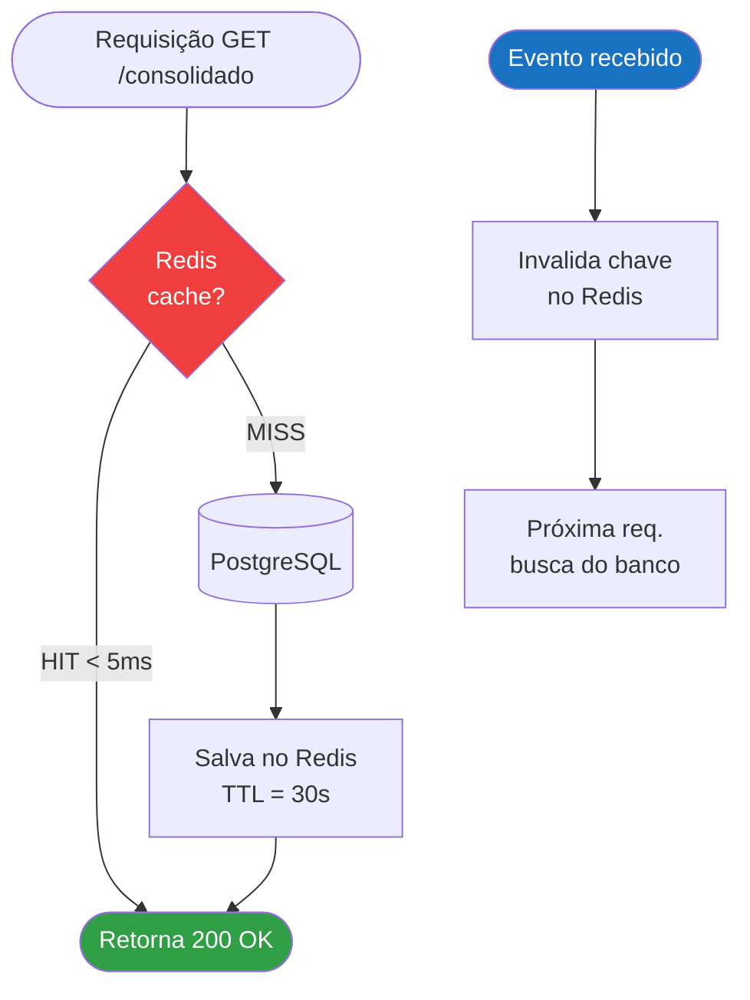

### Retry e Tolerância a Falhas

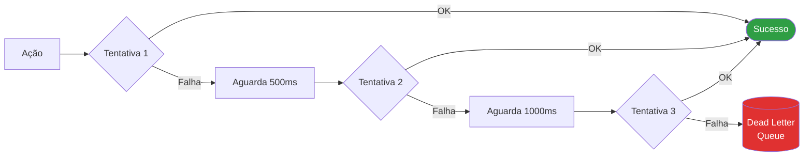

**Implementação:**
```csharp
// RetryPolicy com backoff exponencial
await RetryPolicy.ExecuteAsync(
    action,
    maxAttempts: 3,
    delay: TimeSpan.FromMilliseconds(500));
```

**Circuit Breaker (produção com Polly):**
- Abre após 5 falhas consecutivas
- Half-open após 30s para teste de recuperação
- Fallback: retorna último valor do cache ou 503 com `Retry-After`

---

## ADRs — Decisões Arquiteturais

### ADR-001 — Microsserviços vs Monolito

**Decisão:** Dois microsserviços independentes.

**Contexto:** RNF-01 exige que lançamentos funcionem mesmo se o consolidado cair. Em monolito, uma falha de memória derruba ambos simultaneamente.

| Critério | Monolito | Microsserviços |
|---|---|---|
| Isolamento de falhas | Nenhum | Total |
| Complexidade operacional | Baixa | Alta (mitigada por Docker/K8s) |
| Escalabilidade independente | Impossível | Nativa |
| RNF-01 | Violado | Atendido |

**Escolha:** Microsserviços.

---

### ADR-002 — Outbox Pattern para Atomicidade

**Problema (Dual-Write sem Outbox):**
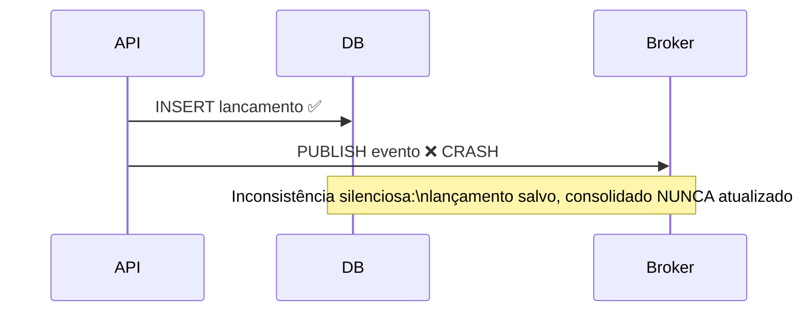

**Solução (com Outbox):**
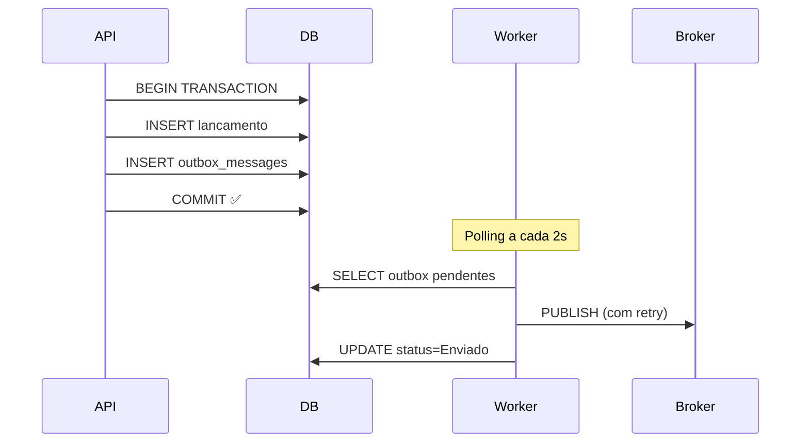

---

### ADR-003 — Cache TTL 30s

**Contexto:** 50 rps = 180.000 queries/hora sem cache — inviável em banco relacional.

| Cenário | Latência | Capacidade |
|---|---|---|
| Sem cache (banco direto) | ~50ms | ~200 rps |
| Cache HIT | < 5ms | > 10.000 rps |
| Cache MISS | ~55ms | Evento de miss raro (TTL alto) |

**Interface abstrai a implementação:**
```csharp
// PoC:      IMemoryCache (sem infra)
// Produção: IDistributedCache + Redis
// Interface: IConsolidadoCache (Domain Layer)
```

---

### ADR-004 — .NET 9 + Minimal API + CQRS

| Componente | Justificativa |
|---|---|
| **.NET 9** | ~15% menos alocações HTTP vs .NET 8; melhor startup em containers |
| **Minimal API** | Menor overhead de reflection vs MVC Controller |
| **CQRS manual** | Separação clara de Commands (escrita) e Queries (leitura) |
| **Domain Events** | Entidades publicam eventos; Application coordena, não controla |
| **Result pattern** | Erros como valores — sem exceptions para controle de fluxo |

---

## Estrutura do Projeto

```
fluxo-de-caixa-banco-carrefour/
│
├── src/
│   ├── Core/                              # Domain Layer — ZERO deps externas
│   │   ├── Entities/
│   │   │   ├── Lancamento.cs             # Entidade rica + Domain Events
│   │   │   └── ConsolidadoDiario.cs      # Projeção do saldo diário
│   │   ├── Events/
│   │   │   ├── LancamentoRegistradoEvent.cs
│   │   │   └── LancamentoCanceladoEvent.cs
│   │   └── Interfaces/
│   │       ├── ILancamentoRepository.cs
│   │       ├── IConsolidadoRepository.cs
│   │       ├── IConsolidadoCache.cs
│   │       └── IMessageBus.cs
│   │
│   ├── Application/                       # Application Layer — Orquestração
│   │   └── UseCases/
│   │       ├── Lancamentos/
│   │       │   └── Commands/
│   │       │       └── CriarLancamentoCommand.cs
│   │       │       └── CancelarLancamentoCommand.cs
│   │       └── ConsolidadoDiario/
│   │           └── Queries/
│   │               └── ObterConsolidadoDiarioQuery.cs
│   │
│   ├── Infrastructure/                    # Infrastructure Layer — Adaptadores
│   │   ├── Cache/
│   │   │   └── InMemoryConsolidadoCache.cs
│   │   ├── Messaging/
│   │   │   └── RabbitMqMessageBus.cs
│   │   ├── Persistence/
│   │   │   ├── InMemoryLancamentoRepository.cs
│   │   │   └── InMemoryConsolidadoRepository.cs
│   │   ├── Resilience/
│   │   │   └── RetryPolicy.cs
│   │   └── DependencyInjection/
│   │       └── InfrastructureServiceCollectionExtensions.cs
│   │
│   ├── Presentation/
│   │   ├── ApiLancamentos/               # API :5001
│   │   │   ├── Controllers/LancamentosController.cs
│   │   │   └── Program.cs
│   │   └── ApiConsolidado/              # API :5002
│   │       ├── Controllers/ConsolidadoController.cs
│   │       └── Program.cs
│   │
│   └── WorkerServices/
│       └── ProcessadorEventos/           # Background Worker
│           └── Worker.cs
│
├── tests/
│   └── FluxoDeCaixa.UnitTests/
│       ├── Core/Entities/
│       │   ├── LancamentoTests.cs        # 14 casos — domínio
│       │   └── ConsolidadoDiarioTests.cs # 8 casos — domínio
│       └── Application/UseCases/
│           ├── Lancamentos/Commands/
│           │   └── CriarLancamentoCommandTests.cs # 9 casos
│           └── ConsolidadoDiario/
│               └── ObterConsolidadoDiarioQueryTests.cs # 5 casos
│
├── docker-compose.yml                    # Stack completa com obs.
└── docs/
    └── solution_architecture.md
```

---

## Observabilidade

### Os Três Pilares

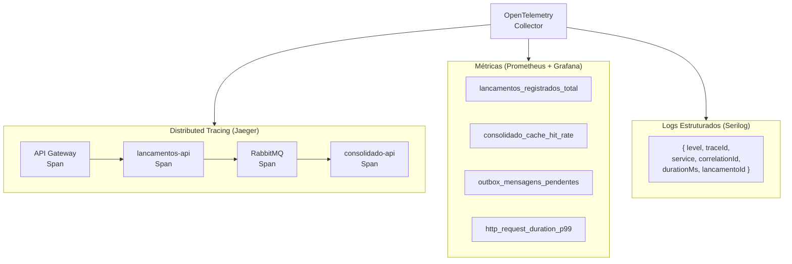

### Alertas Críticos

| Alerta | Condição | Severidade |
|---|---|---|
| Latência alta no consolidado | P99 > 500ms por 2min | Warning |
| Taxa de erros elevada | > 5% de 5xx em 5min | Critical |
| Outbox acumulando | Pendentes > 500 por 5min | Critical |
| Redis indisponível | Connection refused | Warning |
| Serviço indisponível | Health check failing | Critical |

### Health Checks

```csharp
// Liveness: "o processo está vivo?"
app.MapHealthChecks("/health/live");

// Readiness: "pronto para receber tráfego?"
app.MapHealthChecks("/health/ready", new HealthCheckOptions {
    Predicate = c => c.Tags.Contains("ready")
});
```

---

## Segurança

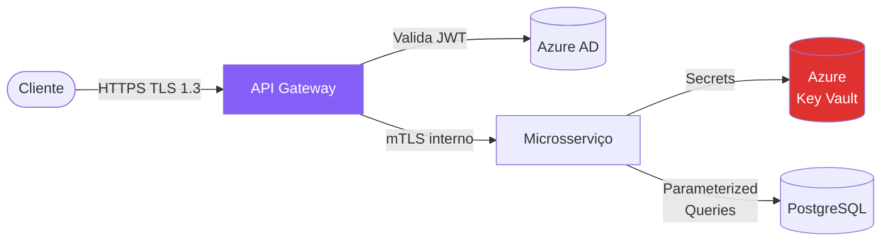

| Camada | Mecanismo |
|---|---|
| Autenticação | JWT Bearer + Azure AD |
| Autorização | Scopes: `lancamentos:write`, `consolidado:read` |
| Transporte | TLS 1.3 obrigatório, HTTPS redirect |
| Comunicação interna | mTLS via Service Mesh (Linkerd) |
| Secrets | Azure Key Vault — nunca em appsettings |
| Injeção SQL | EF Core parameterized queries |
| Rate Limiting | 100 req/min por IP (nativo .NET 9) |

---

## Arquitetura de Transição

### Strangler Fig Pattern — 3 Fases

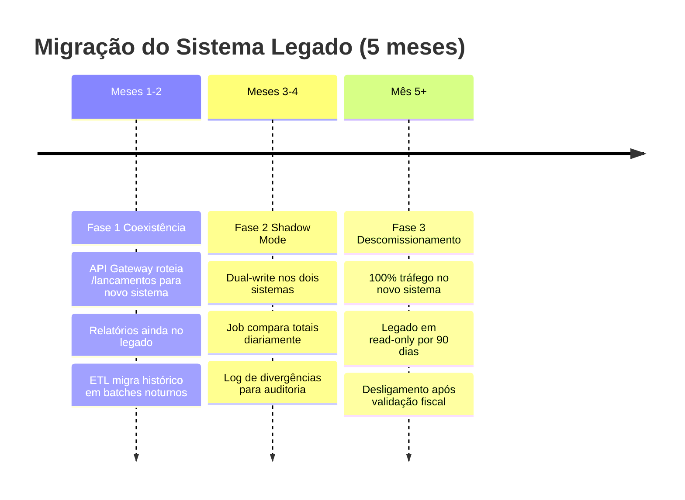

---

## Testes e Qualidade

### Evidência de testes


### Go NoGo


### Pirâmide de Testes

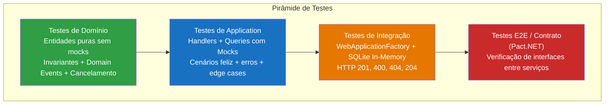

### Cobertura por Suite

| Suite | Casos | Foco |
|---|---|---|
| `LancamentoTests` | 14 | Criação, cancelamento, domain events, validações, edge cases |
| `ConsolidadoDiarioTests` | 8 | Cálculo de saldo, estorno, múltiplos lançamentos |
| `CriarLancamentoCommandTests` | 6 | Handler, persistência, publicação de evento, falha de banco |
| `CancelarLancamentoCommandTests` | 3 | Cancelamento, inexistente, evento publicado |
| `ObterConsolidadoDiarioQueryTests` | 5 | Cache HIT/MISS, zeros, saldo correto |

```bash
# Rodar todos com cobertura
dotnet test --collect:"XPlat Code Coverage"
reportgenerator -reports:"**/coverage.cobertura.xml" -targetdir:"coverage-report"
```

---

## Kubernetes e Infraestrutura

### Deployment Diagram

```mermaid
graph TB
    subgraph AKS["Azure Kubernetes Service (AKS)"]
        subgraph NS["namespace: fluxo-caixa"]
            ING[Ingress Controller\nNGINX]

            subgraph LA_DEP["Deployment: lancamentos-api"]
                LA1[Pod] & LA2[Pod]
            end

            subgraph CA_DEP["Deployment: consolidado-api"]
                CA1[Pod] & CA2[Pod] & CA3[Pod]
            end

            subgraph WK_DEP["Deployment: worker"]
                WK1[Pod]
            end

            SVC_LA[Service\nClusterIP :5001]
            SVC_CA[Service\nClusterIP :5002]

            HPA_LA[HPA\n2-5 réplicas\nCPU > 70%]
            HPA_CA[HPA\n3-10 réplicas\nCPU > 60%]
        end

        subgraph INFRA["Serviços Gerenciados (Azure)"]
            PG1[(Azure DB\nPostgreSQL)]
            PG2[(Azure DB\nPostgreSQL)]
            RD[(Azure Cache\nRedis)]
            SB[(Azure\nService Bus)]
        end
    end

    ING --> SVC_LA --> LA_DEP
    ING --> SVC_CA --> CA_DEP
    LA_DEP --> PG1
    LA_DEP --> SB
    WK_DEP --> SB
    WK_DEP --> PG2
    WK_DEP --> RD
    CA_DEP --> RD
    CA_DEP --> PG2
    HPA_LA -.->|escala| LA_DEP
    HPA_CA -.->|escala| CA_DEP
```

---

## Estimativa de Custos Azure

### Produção (Brazil South)

| Serviço | Configuração | USD/mês |
|---|---|---|
| AKS Node Pool | 3 nós Standard_D2s_v3 | ~$180 |
| Azure DB PostgreSQL Flexible | Burstable B2s · 2 vCores · 4GB | ~$50 |
| Azure Cache for Redis | C1 Standard · 1GB | ~$55 |
| Azure Service Bus | Standard · < 10M mensagens/mês | ~$10 |
| Azure Container Registry | Basic · 10GB | ~$5 |
| Azure Monitor + Log Analytics | 5GB/dia | ~$25 |
| **Total estimado** | | **~$325/mês** |

> **MVP / Dev:** Docker Compose local → **$0**
> **Scale-out:** Adicionar nós e zone redundancy → **~$600/mês**

---

## Evoluções Futuras

```mermaid
timeline
    title Roadmap Arquitetural

    Curto Prazo : Event Sourcing com EventStoreDB
               : Pact.NET contract testing entre serviços
               : GitHub Actions CI/CD com gate de cobertura 80%

    Médio Prazo : CQRS com read replica PostgreSQL dedicada
               : Saga Pattern para transações distribuídas
               : Multi-tenancy — múltiplas contas por comerciante

    Longo Prazo : ML para previsão de fluxo de caixa
               : Conciliação bancária via importação OFX
               : Chaos Engineering com Simmy
               : Terraform IaC para toda infra Azure
```

---

## Como Rodar Localmente

### Opção A — Docker Compose (stack completa)

```bash
git clone <url-do-repositorio>
cd fluxo-de-caixa-banco-carrefour

docker compose up --build

# APIs disponíveis:
# http://localhost:5001/swagger  — Lançamentos
# http://localhost:5002/swagger  — Consolidado
# http://localhost:15672         — RabbitMQ Management
# http://localhost:3000          — Grafana (admin/admin123)
# http://localhost:16686         — Jaeger Traces
```

### Opção B — Apenas .NET (sem Docker)

```bash
# Terminal 1 — API Lançamentos
cd src/Presentation/ApiLancamentos
dotnet run

# Terminal 2 — API Consolidado
cd src/Presentation/ApiConsolidado
dotnet run

# Terminal 3 — Worker
cd src/WorkerServices/ProcessadorEventos
dotnet run
```

### Teste Rápido (fluxo completo)

```bash
# 1. Registrar crédito
curl -X POST http://localhost:5001/api/lancamentos \
  -H "Content-Type: application/json" \
  -d '{"tipo": 2, "conta": "12345", "valor": 1500.00, "descricao": "Venda do dia"}'
# → 201 Created {"id": "...", "dataLancamento": "2025-01-15"}

# 2. Registrar débito
curl -X POST http://localhost:5001/api/lancamentos \
  -H "Content-Type: application/json" \
  -d '{"tipo": 1, "conta": "12345", "valor": 300.00, "descricao": "Aluguel"}'

# 3. Aguardar processamento assíncrono (~2s)
sleep 2

# 4. Consultar consolidado
curl http://localhost:5002/api/consolidado/2025-01-15?conta=12345
# → {"totalCreditos": 1500.00, "totalDebitos": 300.00, "saldoLiquido": 1200.00}

# 5. Cancelar lançamento
curl -X DELETE http://localhost:5001/api/lancamentos/{id}
# → 204 No Content

# 6. Rodar testes
dotnet test
```

---

## Endpoints da API

### lancamentos-api — :5001

| Método | Endpoint | Descrição | Response |
|---|---|---|---|
| `POST` | `/api/lancamentos` | Registra novo lançamento | `201 Created {id, dataLancamento}` |
| `GET` | `/api/lancamentos/{data}` | Lista lançamentos de uma data | `200 OK [{...}]` |
| `DELETE` | `/api/lancamentos/{id}` | Cancela lançamento (soft-delete) | `204 No Content` |
| `GET` | `/health` | Health check | `200 Healthy` |

### consolidado-api — :5002

| Método | Endpoint | Descrição | Response |
|---|---|---|---|
| `GET` | `/api/consolidado/{data}` | Saldo consolidado de um dia | `200 OK {totalCreditos, totalDebitos, saldoLiquido}` |
| `GET` | `/api/consolidado/hoje` | Saldo do dia atual | `200 OK {...}` |
| `GET` | `/health` | Health check | `200 Healthy` |

---

*Banco Carrefour — Desafio Arquiteto de Soluções — 2026*
