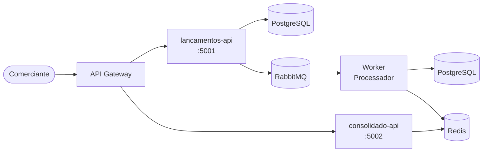

# Sistema de Controle de Fluxo de Caixa — Banco Carrefour

> Solução para o desafio técnico de Arquiteto de Soluções com foco em Clean Architecture, DDD, CQRS, Event-Driven e Microsserviços.

## Visão Rápida



## Arquitetura em Camadas (Clean Architecture)

| Camada | Responsabilidade | Dependências |
|---|---|---|
| **Domain (Core)** | Entidades, Domain Events, Invariantes, Interfaces | Nenhuma |
| **Application** | Commands, Queries, Handlers, Pipeline | Domain |
| **Infrastructure** | EF Core, Redis, RabbitMQ, Retry | Domain |
| **Presentation** | Controllers, Middleware, Health Checks | Application |

## Tecnologias

| Componente | PoC (este repo) | Produção |
|---|---|---|
| Runtime | .NET 9 | .NET 9 |
| Banco de Dados | In-Memory | PostgreSQL 16 |
| Mensageria | RabbitMQ | Azure Service Bus |
| Cache | IMemoryCache | Redis 7 |
| Containers | Docker Compose | AKS (Kubernetes) |
| Observabilidade | Console logs | OTel + Jaeger + Grafana |

## Como Rodar

```bash
# Opção 1: Docker Compose (stack completa)
docker compose up --build

# Opção 2: Apenas .NET
dotnet run --project src/Presentation/ApiLancamentos
dotnet run --project src/Presentation/ApiConsolidado
dotnet run --project src/WorkerServices/ProcessadorEventos

# Testes
dotnet test
```

## Endpoints

| Serviço | Endpoint | Descrição |
|---|---|---|
| lancamentos-api :5001 | `POST /api/lancamentos` | Registra débito ou crédito |
| lancamentos-api :5001 | `GET /api/lancamentos/{data}` | Lista por data |
| lancamentos-api :5001 | `DELETE /api/lancamentos/{id}` | Cancela (soft-delete) |
| consolidado-api :5002 | `GET /api/consolidado/{data}` | Saldo por data |
| consolidado-api :5002 | `GET /api/consolidado/hoje` | Saldo do dia atual |

## Documentação

- [Arquitetura Detalhada](docs/solution_architecture.md) — C4, CQRS, Outbox, ADRs, NFRs
- [Diagrama de Use Cases](docs/use_cases.md) — 29 use cases em 5 módulos com atores, fluxos e rastreabilidade
- [README Principal](../README.md) — Visão completa com todos os diagramas Mermaid
