# Arquitetura da Solução — Sistema de Controle de Fluxo de Caixa

> **Banco Carrefour · Desafio Arquiteto de Soluções · 2026**

---

## 1. Mapeamento de Domínios Funcionais e Capacidades de Negócio

### 1.1 Bounded Contexts (Domain-Driven Design)

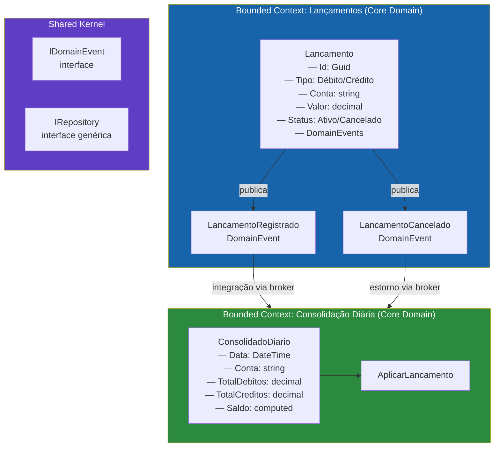

### 1.2 Linguagem Ubíqua

| Termo | Contexto | Definição |
|---|---|---|
| **Lançamento** | Lançamentos | Registro atômico de entrada ou saída financeira na conta de um comerciante |
| **Débito** | Lançamentos | Saída de caixa — reduz TotalDebitos do consolidado |
| **Crédito** | Lançamentos | Entrada de caixa — aumenta TotalCreditos do consolidado |
| **Cancelamento** | Lançamentos | Reversão de um lançamento ativo via soft-delete |
| **Consolidado Diário** | Consolidação | Projeção calculada e persistida do saldo financeiro de um dia |
| **Saldo Líquido** | Consolidação | `TotalCréditos − TotalDébitos` calculado no domínio |
| **Estorno** | Consolidação | Efeito no consolidado quando um lançamento é cancelado |

### 1.3 Capacidades de Negócio

| ID | Capacidade | Domínio | Criticidade | SLA |
|---|---|---|---|---|
| CAP-01 | Registrar lançamento de débito/crédito | Lançamentos | Crítica | 99.9% |
| CAP-02 | Cancelar lançamento (soft-delete) | Lançamentos | Alta | 99.5% |
| CAP-03 | Consultar lançamentos por data | Lançamentos | Alta | 99.5% |
| CAP-04 | Consultar saldo consolidado do dia | Consolidação | Crítica | 99.9% |
| CAP-05 | Reprocessar consolidado (admin) | Consolidação | Média | 99.0% |

---

## 2. Requisitos Funcionais e Não Funcionais Refinados

### 2.1 Requisitos Funcionais

#### Serviço de Lançamentos

| ID | Requisito | Critério de Aceitação |
|---|---|---|
| RF-01 | Registrar lançamento de débito | Persistido com tipo=DEBITO, valor>0, conta, descrição, data ≤ hoje |
| RF-02 | Registrar lançamento de crédito | Persistido com tipo=CREDITO, valor>0, conta, descrição, data ≤ hoje |
| RF-03 | Listar lançamentos por data | Retorna todos (ativos e cancelados) de uma data no formato `yyyy-MM-dd` |
| RF-04 | Cancelar lançamento | Soft-delete — status=Cancelado; evento publicado para estornar no consolidado |
| RF-05 | Validar lançamento | Rejeitar: valor ≤ 0, valor > 10M, descrição vazia, descrição > 255 chars, data futura |

#### Serviço de Consolidado Diário

| ID | Requisito | Critério de Aceitação |
|---|---|---|
| RF-06 | Consultar saldo por data | Retorna TotalCréditos, TotalDébitos, SaldoLíquido da data informada |
| RF-07 | Consultar saldo do dia atual | Atalho para data = hoje |
| RF-08 | Consolidado zerado para dia sem lançamentos | Retorna zeros — nunca 404 |

### 2.2 Requisitos Não Funcionais

| ID | Categoria | Requisito | Meta | Mecanismo |
|---|---|---|---|---|
| **RNF-01** | **Disponibilidade** | Lançamentos independentes do consolidado | 100% isolamento | Microsserviços + mensageria assíncrona |
| **RNF-02** | **Throughput** | 50 rps no consolidado | P99 < 200ms | Cache Redis TTL 30s |
| **RNF-03** | **Confiabilidade** | Máx. 5% perda no consolidado | ≥ 95% sucesso | Cache como fallback; sem SPOF |
| RNF-04 | Atomicidade | Lançamento salvo = evento publicado | Zero inconsistência | Outbox Pattern |
| RNF-05 | Consistência | Atualização eventual do consolidado | Defasagem < 5s | OutboxRelayWorker poll 2s |
| RNF-06 | Rastreabilidade | Logs com CorrelationId | 100% requests | Serilog + OpenTelemetry |
| RNF-07 | Escalabilidade | Horizontal sem estado local | Zero in-memory sessions | Stateless + Redis externo |
| RNF-08 | Resiliência | Falha no broker não derruba lançamentos | Zero perda | Outbox persiste antes de publicar |
| RNF-09 | Concorrência | Updates simultâneos no consolidado | Sem race condition | `SELECT FOR UPDATE` + ConcurrentDictionary |
| RNF-10 | Segurança | Endpoints protegidos | 100% autenticado | JWT + mTLS + Key Vault |

---

## 3. Desenho da Solução Completo

### 3.1 Visão Geral (C4 — Nível de Contexto)

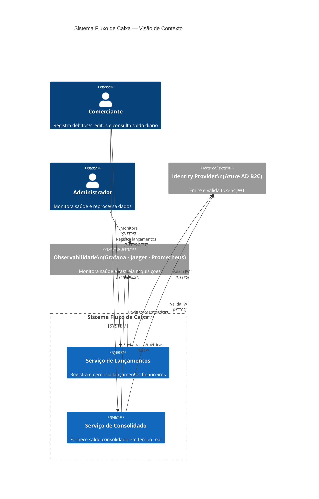

### 3.2 Visão de Contêineres (C4 — Nível 2)

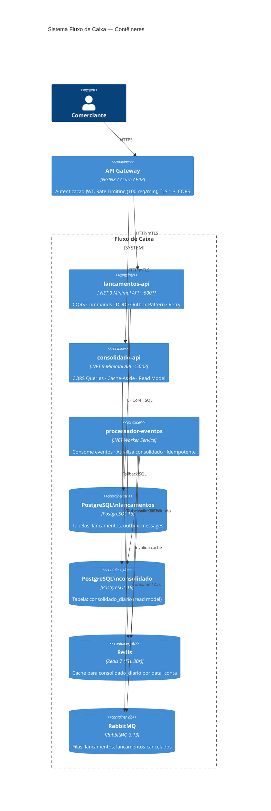

### 3.3 Camadas Internas — Clean Architecture

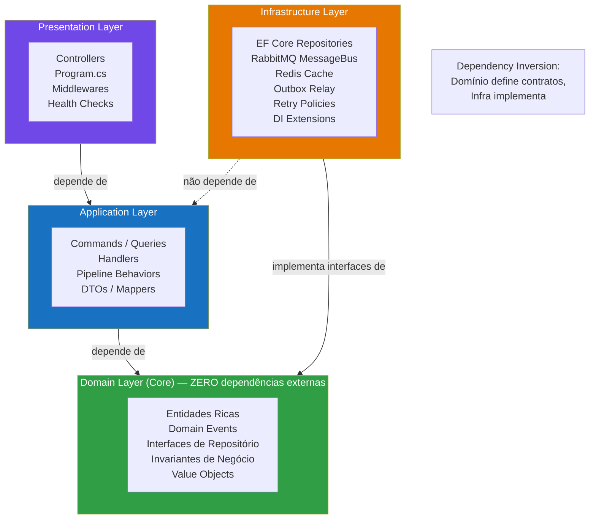

---

## 4. Padrões Arquiteturais em Detalhes

### 4.1 CQRS — Separação de Leitura e Escrita

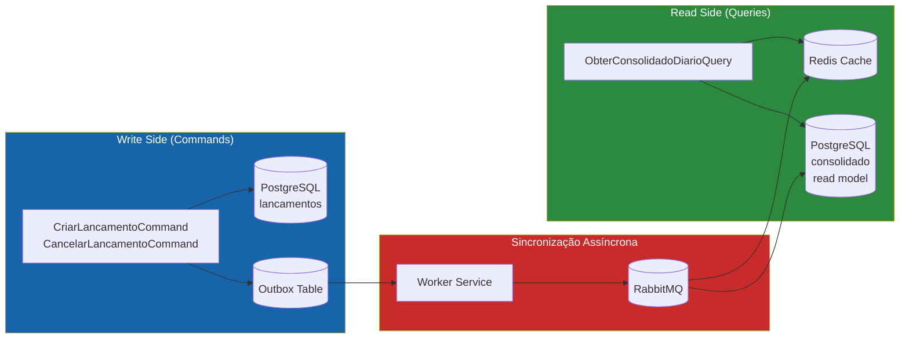

### 4.2 Outbox Pattern — Atomicidade Garantida

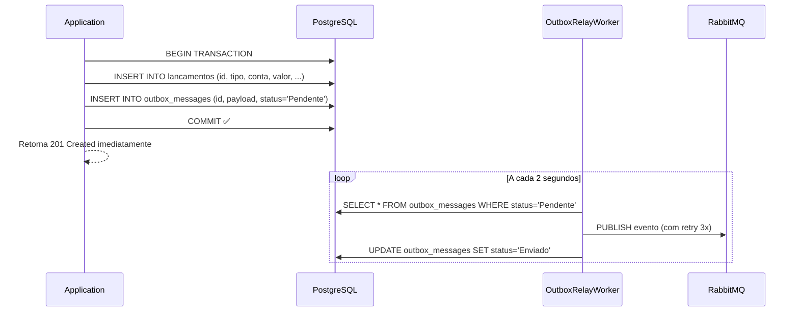

### 4.3 Domain Events — Entidade Rica

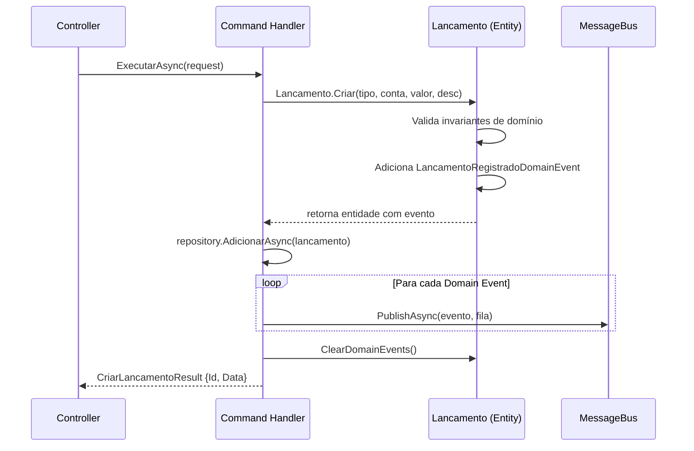

---

## 5. Requisitos Não Funcionais em Detalhe

### 5.1 Estratégia de Escalabilidade

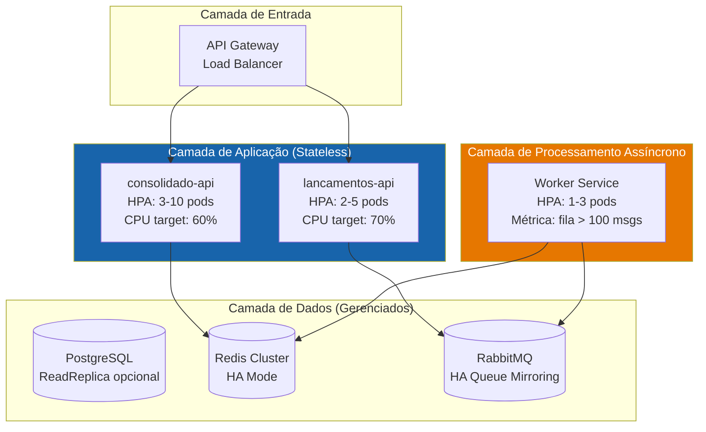

**Princípios:**
- **Zero in-memory state:** toda sessão em Redis externo; qualquer pod pode responder qualquer request
- **HPA metric-based:** consolidado-api escala por CPU; worker escala pelo tamanho da fila RabbitMQ
- **Connection pooling:** EF Core pool de conexões configurado por número de CPUs da instância
- **Graceful shutdown:** draining de conexões em `IHostApplicationLifetime.ApplicationStopping`

### 5.2 Controle de Concorrência

| Camada | Mecanismo | Cenário |
|---|---|---|
| In-Memory (PoC) | `ConcurrentDictionary` | Thread-safety nas operações de repositório |
| PostgreSQL | `SELECT FOR UPDATE` | Dois workers atualizando o mesmo consolidado |
| RabbitMQ | `BasicQos(prefetchCount: 1)` | Worker processa uma mensagem por vez |
| Idempotência | `MessageId` único + `IF NOT EXISTS` | Previne processamento duplicado em retry |

### 5.3 Cache Strategy (Cache-Aside)

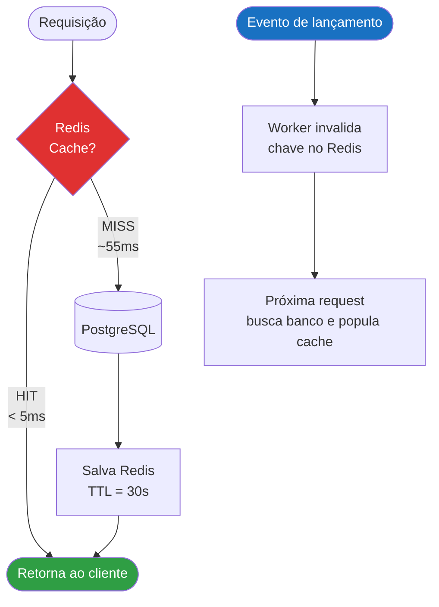

### 5.4 Tolerância a Falhas

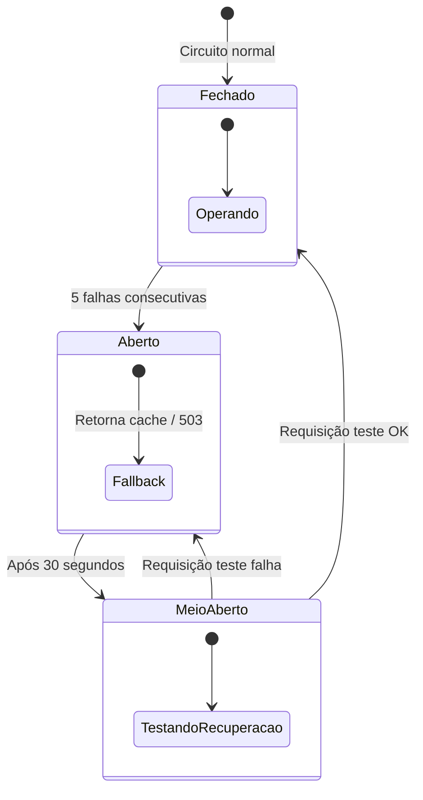

**Políticas implementadas:**
- `RetryPolicy`: 3 tentativas com backoff 500ms → 1s → 2s
- Circuit Breaker (Polly em produção): protege PostgreSQL e RabbitMQ
- Health Checks Liveness/Readiness no Kubernetes: pods não recebem tráfego até estarem prontos
- Dead Letter Queue: mensagens que falharam 3x vão para DLQ para análise manual

### 5.5 Observabilidade Completa

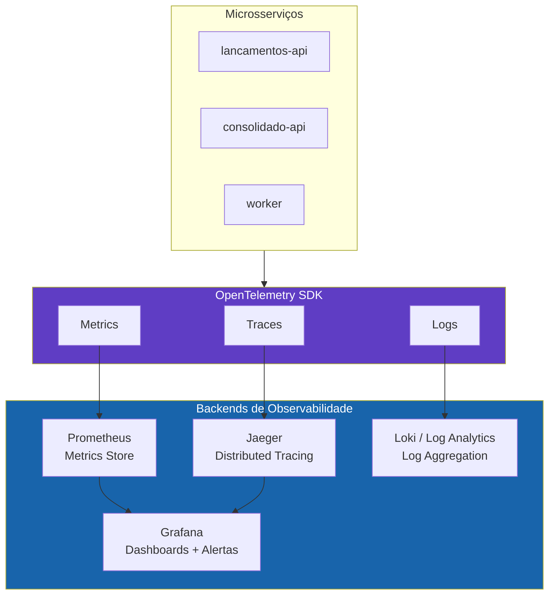

**Métricas customizadas de negócio:**
```csharp
var lancamentosTotal = meter.CreateCounter<long>("lancamentos_registrados_total",
    description: "Total de lançamentos registrados");

var cacheHitRate = meter.CreateObservableGauge<double>("consolidado_cache_hit_rate",
    description: "Taxa de cache hit no consolidado");

var outboxPendentes = meter.CreateObservableGauge<int>("outbox_mensagens_pendentes",
    description: "Mensagens aguardando envio no Outbox");
```

---

## 6. Estrutura do Projeto — Clean Architecture

```
fluxo-de-caixa-banco-carrefour/
│
├── src/
│   ├── Core/                              ← Domain Layer
│   │   ├── Entities/
│   │   │   ├── Lancamento.cs             ← Entidade rica com Domain Events
│   │   │   └── ConsolidadoDiario.cs      ← Agregado de consolidação
│   │   ├── Events/
│   │   │   ├── LancamentoRegistradoEvent.cs
│   │   │   └── LancamentoCanceladoEvent.cs
│   │   └── Interfaces/
│   │       ├── ILancamentoRepository.cs
│   │       ├── IConsolidadoRepository.cs
│   │       ├── IConsolidadoCache.cs
│   │       └── IMessageBus.cs
│   │
│   ├── Application/                       ← Application Layer
│   │   └── UseCases/
│   │       ├── Lancamentos/Commands/
│   │       │   ├── CriarLancamentoCommand.cs
│   │       │   └── CancelarLancamentoCommand.cs
│   │       └── ConsolidadoDiario/Queries/
│   │           └── ObterConsolidadoDiarioQuery.cs
│   │
│   ├── Infrastructure/                    ← Infrastructure Layer
│   │   ├── Cache/InMemoryConsolidadoCache.cs
│   │   ├── Messaging/RabbitMqMessageBus.cs
│   │   ├── Persistence/
│   │   │   ├── InMemoryLancamentoRepository.cs
│   │   │   └── InMemoryConsolidadoRepository.cs
│   │   ├── Resilience/RetryPolicy.cs
│   │   └── DependencyInjection/
│   │       └── InfrastructureServiceCollectionExtensions.cs
│   │
│   ├── Presentation/
│   │   ├── ApiLancamentos/               ← :5001
│   │   │   ├── Controllers/LancamentosController.cs
│   │   │   └── Program.cs
│   │   └── ApiConsolidado/              ← :5002
│   │       ├── Controllers/ConsolidadoController.cs
│   │       └── Program.cs
│   │
│   └── WorkerServices/ProcessadorEventos/
│       └── Worker.cs
│
├── tests/
│   └── FluxoDeCaixa.UnitTests/
│       ├── Core/Entities/
│       │   ├── LancamentoTests.cs        ← 14 casos
│       │   └── ConsolidadoDiarioTests.cs ← 8 casos
│       └── Application/UseCases/
│           ├── Lancamentos/
│           │   └── CriarLancamentoCommandTests.cs ← 9 casos
│           └── ConsolidadoDiario/
│               └── ObterConsolidadoDiarioQueryTests.cs ← 5 casos
│
└── docker-compose.yml                    ← Stack completa: APIs + PG + Redis + RabbitMQ + Obs.
```

---

## 7. Testes e Qualidade

### 7.1 Estratégia de Testes

```mermaid
pyramid
    "Testes de Contrato (Pact.NET)" : 0
    "Testes E2E (WebApplicationFactory)" : 0
    "Testes de Integração (SQLite InMemory)" : 0
    "Testes de Application (Mocks)" : 0
    "Testes de Domínio (Puras)" : 0
```

| Camada | Framework | Foco | Casos |
|---|---|---|---|
| Domínio | xUnit + FluentAssertions | Invariantes, Domain Events, cancelamento | 22 |
| Application | xUnit + Moq | Commands, Queries, cenários de erro | 14 |
| Integração | WebApplicationFactory | HTTP completo, banco real em memória | Próximo passo |
| Contrato | Pact.NET | Compatibilidade entre lancamentos-api e consolidado-api | Próximo passo |

### 7.2 Cenários de Erro Cobertos

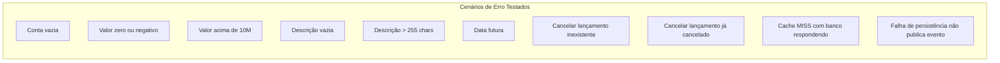

### 7.3 Próximos Passos de Qualidade

```csharp
// Teste de Contrato (Pact.NET) — a implementar
[Fact]
public async Task Consolidado_Api_Deve_Respeitar_Contrato_Lancamentos()
{
    // Verifica que consolidado-api processa corretamente
    // o payload publicado por lancamentos-api
    // Previne breaking changes silenciosos entre serviços
}
```

---

## 8. Arquitetura de Transição (AS-IS → TO-BE)

```mermaid
journey
    title Jornada de Migração do Legado
    section Mês 1-2: Coexistência
        Deploy novo sistema: 5: Time
        Gateway roteia /lancamentos para novo: 4: Time
        ETL migra histórico em batches: 3: Time
        Validação dos primeiros dados: 4: Time
    section Mês 3-4: Shadow Mode
        Dual-write nos dois sistemas: 3: Time
        Job compara totais diariamente: 4: Time
        Zero divergências por 2 semanas: 5: Time
    section Mês 5+: Descomissionamento
        100% tráfego no novo sistema: 5: Time
        Legado em read-only 90 dias: 4: Time
        Desligamento validado: 5: Time
```

---

## 9. Decisões Arquiteturais (ADRs)

### ADR-001: Microsserviços

**Status:** Aceito

**Contexto:** RNF-01 exige isolamento total. Monolito viola este requisito por compartilhar processo.

**Consequências:**
- Isolamento de falhas garantido
- Escalonamento independente
- Complexidade operacional mitigada por Docker/Kubernetes

### ADR-002: Outbox Pattern

**Status:** Aceito

**Contexto:** Dual-write sem Outbox cria janela de inconsistência silenciosa entre lançamento salvo e evento publicado.

**Consequências:**
- Atomicidade garantida entre persistência e mensagem
- Latência adicional de ~2s (aceitável para consistência eventual)
- Auditoria nativa na tabela `outbox_messages`

### ADR-003: Cache TTL 30s com Redis

**Status:** Aceito

**Contexto:** 50 rps = 180.000 queries/hora sem cache. Banco PostgreSQL satura com ~200 rps.

**Consequências:**
- Cache HIT: <5ms, >10.000 rps
- Consistência eventual com defasagem máxima de 30s (aceitável)
- Interface `IConsolidadoCache` permite trocar implementação sem tocar no domínio

### ADR-004: .NET 9 Minimal API + CQRS Manual

**Status:** Aceito

**Contexto:** Performance e startup em containers são críticos.

**Consequências:**
- ~15% menos alocações HTTP vs .NET 8
- CQRS sem MediatR reduz overhead de reflection
- Testabilidade total dos handlers isolados

### ADR-005: PostgreSQL (Produção) / SQLite ou InMemory (PoC)

**Status:** Aceito

**Contexto:** PoC deve rodar sem infraestrutura externa para avaliação rápida.

**Consequências:**
- Troca é transparente via interfaces do repositório
- Mesma lógica de domínio em todos os ambientes
- Migrations EF Core funcionam nos dois providers

---

## 10. Evoluções Futuras

```mermaid
graph LR
    subgraph NOW["Implementado"]
        A[Clean Architecture]
        B[CQRS + DDD]
        C[Domain Events]
        D[Outbox Pattern]
        E[Cache Redis]
        F[Retry Policy]
        G[RabbitMQ]
        H[Docker Compose]
    end

    subgraph NEXT["Próximo Ciclo"]
        I[Event Sourcing\nEventStoreDB]
        J[Pact.NET\nContract Testing]
        K[GitHub Actions\nCI/CD + Coverage Gate]
        L[Kubernetes\nHelm Charts]
    end

    subgraph FUTURE["Futuro"]
        M[Saga Pattern\nTransações Distribuídas]
        N[Multi-Tenancy\nMúltiplas contas]
        O[ML Previsão\nFluxo de Caixa]
        P[Chaos Engineering\nSimmy / Chaos Monkey]
    end

    NOW --> NEXT --> FUTURE
```

---

*Banco Carrefour · Desafio Arquiteto de Soluções · Paulo Marne · 2026*
