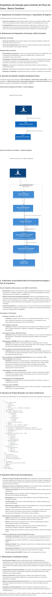

# Arquitetura da Solução para Controle de Fluxo de Caixa - Banco Carrefour

## 1. Mapeamento de Domínios Funcionais e Capacidades de Negócio

O desafio apresenta dois domínios funcionais principais:

-   **Controle de Lançamentos**: Responsável por registrar e gerenciar as operações de débito e crédito. Esta é uma capacidade transacional, exigindo alta consistência e disponibilidade para a escrita.
-   **Consolidado Diário**: Responsável por gerar relatórios do saldo diário consolidado. Esta é uma capacidade de consulta, que demanda alta performance e disponibilidade para a leitura, podendo tolerar uma eventual inconsistência temporária (eventual consistency) em favor da velocidade.

## 2. Refinamento dos Requisitos Funcionais e Não Funcionais

### Requisitos Funcionais

-   **Serviço de Lançamentos**: Deve permitir a criação de novos lançamentos (débitos e créditos) com informações como tipo, conta e valor.
-   **Serviço de Consolidado Diário**: Deve fornecer um relatório consolidado por período, exibindo data, conta, total de débitos, total de créditos e saldo total.

### Requisitos Não Funcionais

-   **Disponibilidade (Lançamentos)**: O serviço de controle de lançamentos deve ser independente e não ser afetado pela indisponibilidade do serviço de consolidado diário. Isso implica um forte desacoplamento entre os dois serviços.
-   **Escalabilidade e Performance (Consolidado Diário)**: O serviço de consolidado diário deve suportar 50 requisições por segundo com no máximo 5% de perda. Isso sugere a necessidade de otimização para leitura e, possivelmente, um modelo de dados diferente do de escrita.
-   **Resiliência**: A solução deve ser projetada para recuperação de falhas, incluindo redundância e monitoramento proativo.
-   **Segurança**: Implementação de autenticação, autorização e criptografia para proteger dados e sistemas.
-   **Reutilização e Flexibilidade**: A arquitetura deve permitir a evolução e a reutilização de componentes.

## 3. Desenho da Solução Completo (Arquitetura Alvo)

A arquitetura proposta adota princípios de **Clean Architecture** e **Domain-Driven Design (DDD)**, com uma abordagem de **CQRS (Command Query Responsibility Segregation)** e **Event-Driven Architecture** para atender aos requisitos de desacoplamento, escalabilidade e resiliência.

### Visão Geral da Arquitetura (C4 Model - Context Diagram)


### Visão de Contêineres (C4 Model - Container Diagram)



## 4. Justificativa na Decisão/Escolha de Ferramentas/Tecnologias e Tipo de Arquitetura

### Tipo de Arquitetura: Microsserviços com CQRS e Event-Driven

-   **Microsserviços**: Permite o desenvolvimento, deploy e escalabilidade independentes dos serviços de Lançamentos e Consolidado, atendendo ao requisito não funcional de disponibilidade (o serviço de lançamentos não deve ser afetado se o consolidado cair).
-   **CQRS (Command Query Responsibility Segregation)**: Separa as responsabilidades de escrita (comandos) e leitura (queries). A API de Lançamentos lida com os comandos e persiste os eventos, enquanto a API de Consolidado lida com as queries, consultando um modelo de leitura otimizado. Isso permite escalar e otimizar cada parte de forma independente, crucial para o requisito de 50 req/s no consolidado.
-   **Event-Driven Architecture**: A comunicação entre os serviços é feita através de eventos publicados em um Message Broker. Isso garante o desacoplamento, a resiliência e a capacidade de processamento assíncrono, fundamental para a escalabilidade.

### Tecnologias e Ferramentas

-   **Linguagem e Framework**: **C# e .NET 8/9**.
    -   **Justificativa**: Linguagem robusta, madura e com excelente suporte da Microsoft. O .NET 8/9 oferece melhorias de performance, novas funcionalidades e um ecossistema rico para desenvolvimento de microsserviços, APIs e Worker Services.
-   **APIs**: **ASP.NET Core Web API**.
    -   **Justificativa**: Framework de alta performance para construção de APIs RESTful, com suporte nativo a injeção de dependência, middlewares e integração com Swagger/OpenAPI para documentação.
-   **Processador de Eventos**: **.NET Worker Service**.
    -   **Justificativa**: Ideal para execução de tarefas em background, como o consumo de mensagens do Message Broker e a atualização do Read Model, garantindo resiliência e processamento assíncrono.
-   **Message Broker**: **RabbitMQ** (opção inicial) ou **Kafka** (para alta escala).
    -   **Justificativa**: Essencial para a comunicação assíncrona e desacoplada entre os serviços. RabbitMQ é mais simples para começar, enquanto Kafka oferece maior throughput e durabilidade para cenários de altíssima escala e Event Sourcing puro.
-   **Banco de Dados de Lançamentos (Event Store)**: **SQL Server** ou **PostgreSQL**.
    -   **Justificativa**: Bancos de dados relacionais robustos e amplamente utilizados, garantindo ACID para a persistência dos eventos de lançamentos. Podem ser usados com Entity Framework Core para mapeamento objeto-relacional.
-   **Banco de Dados de Consolidado (Read Model)**: **Redis** (para cache e agregação) ou **SQL Server/PostgreSQL** (tabela otimizada).
    -   **Justificativa**: Para atender ao requisito de 50 req/s, o Read Model deve ser otimizado para leitura. Redis pode atuar como um cache distribuído ou até mesmo como o banco de dados principal para o Read Model, armazenando os saldos consolidados de forma rápida. Alternativamente, uma tabela desnormalizada em um banco relacional pode ser criada e atualizada pelo Processador de Eventos.
-   **Testes Unitários**: **xUnit**, **Moq**, **FluentAssertions**.
    -   **Justificativa**: xUnit é um framework de testes moderno e extensível. Moq facilita a criação de mocks para isolar unidades de código. FluentAssertions oferece uma sintaxe mais legível e expressiva para asserções nos testes.
-   **Documentação de API**: **Swagger/OpenAPI**.
    -   **Justificativa**: Ferramenta padrão para documentar APIs RESTful, facilitando o consumo e a compreensão dos serviços.
-   **Controle de Versão**: **Git/GitHub**.
    -   **Justificativa**: Padrão de mercado para controle de versão e colaboração. O repositório público no GitHub atende a um requisito obrigatório.

## 5. Estrutura do Projeto (Exemplo com Clean Architecture)

Uma estrutura de projeto baseada em Clean Architecture para .NET pode ser organizada da seguinte forma:

```
├── src/
│   ├── Core/ (Domain Layer)
│   │   ├── Entities/
│   │   ├── ValueObjects/
│   │   ├── Enums/
│   │   ├── Interfaces/ (e.g., IUnitOfWork, IRepository)
│   │   └── Exceptions/
│   ├── Application/ (Application Layer)
│   │   ├── UseCases/ (Commands e Queries)
│   │   │   ├── Lancamentos/
│   │   │   │   ├── Commands/
│   │   │   │   └── Queries/
│   │   │   └── ConsolidadoDiario/
│   │   │       ├── Commands/
│   │   │       └── Queries/
│   │   ├── Services/ (Domain Services)
│   │   ├── Mappers/
│   │   └── Behaviors/ (e.g., Validation, Logging)
│   ├── Infrastructure/ (Infrastructure Layer)
│   │   ├── Persistence/ (Implementações de repositórios, DbContext)
│   │   ├── MessageBroker/ (Implementações de publicação/consumo de mensagens)
│   │   ├── ExternalServices/
│   │   └── Migrations/
│   ├── Presentation/ (Presentation Layer - APIs)
│   │   ├── ApiLancamentos/
│   │   │   ├── Controllers/
│   │   │   ├── Program.cs
│   │   │   └── appsettings.json
│   │   └── ApiConsolidadoDiario/
│   │       ├── Controllers/
│   │       ├── Program.cs
│   │       └── appsettings.json
│   └── WorkerServices/
│       └── ProcessadorEventos/
│           ├── Worker.cs
│           ├── Program.cs
│           └── appsettings.json
├── tests/
│   ├── Core.UnitTests/
│   ├── Application.UnitTests/
│   ├── Infrastructure.UnitTests/
│   └── Presentation.IntegrationTests/
├── docs/
│   ├── C4_Diagrams/
│   ├── ADRs/ (Architectural Decision Records)
│   └── README.md
├── .gitignore
├── .editorconfig
└── docker-compose.yml
```

## 6. Requisitos Diferenciais (Considerações)

-   **Desenho da solução da Arquitetura de Transição**: Não é estritamente necessária para este desafio, pois estamos projetando uma solução do zero. No entanto, se houvesse um legado, a estratégia seria de 
migração gradual, utilizando padrões como Strangler Fig Pattern para substituir partes do sistema legado por novos microsserviços.
-   **Estimativa de custos com infraestrutura e licenças**: Para uma estimativa inicial, considerando uma implantação em nuvem (Azure, AWS ou GCP), os custos envolveriam:
    -   **Serviços de Computação**: App Services/Containers para as APIs e Worker Services (custo por instância/hora).
    -   **Banco de Dados**: Azure SQL Database, AWS RDS (PostgreSQL/SQL Server) ou Google Cloud SQL (custo por vCore/GB de armazenamento).
    -   **Message Broker**: Azure Service Bus, AWS SQS/SNS ou Google Cloud Pub/Sub (custo por mensagem/throughput).
    -   **Cache/Read Model**: Azure Cache for Redis, AWS ElastiCache ou Google Cloud Memorystore (custo por instância/GB).
    -   **Monitoramento e Logging**: Azure Monitor, AWS CloudWatch/X-Ray ou Google Cloud Operations (custo por ingestão/armazenamento de logs e métricas).
    -   **Licenças**: O .NET é open-source, então não há custo de licença para o framework. Bancos de dados como SQL Server podem ter custos de licença, mas PostgreSQL é open-source. Ferramentas de monitoramento e CI/CD podem ter custos associados.
-   **Monitoramento e Observabilidade**: Essenciais para garantir a saúde e o desempenho da aplicação.
    -   **Logging**: Utilizar bibliotecas como Serilog ou NLog para estruturar logs e enviá-los para um sistema centralizado (e.g., Azure Application Insights, ELK Stack, Grafana Loki).
    -   **Métricas**: Coletar métricas de desempenho (CPU, memória, requisições/segundo, latência) usando Application Insights, Prometheus/Grafana.
    -   **Tracing Distribuído**: Implementar OpenTelemetry para rastrear requisições através dos microsserviços, facilitando a depuração e identificação de gargalos.
    -   **Alertas**: Configurar alertas baseados em métricas e logs para notificar a equipe sobre problemas críticos.
-   **Critérios de segurança para consumo (integração) de serviços**: 
    -   **Autenticação e Autorização**: Utilizar OAuth 2.0 e OpenID Connect para proteger as APIs. Para comunicação entre microsserviços, pode-se usar mTLS (mutual TLS) ou tokens JWT internos.
    -   **Criptografia**: Dados em trânsito (TLS/HTTPS) e em repouso (criptografia de disco e banco de dados).
    -   **Validação de Entrada**: Todas as entradas de usuário devem ser validadas para prevenir ataques como injeção de SQL, XSS, etc.
    -   **Gerenciamento de Segredos**: Utilizar um Key Vault (Azure Key Vault, AWS Secrets Manager, HashiCorp Vault) para armazenar credenciais e chaves de API de forma segura.
    -   **Firewall de Aplicação Web (WAF)**: Proteger as APIs contra ataques comuns da web.

## 7. Observações e Evoluções Futuras

-   **Event Sourcing Completo**: Embora a solução proposta utilize um Message Broker para desacoplamento, uma evolução natural seria a implementação completa de Event Sourcing para o domínio de lançamentos, onde o banco de dados de lançamentos seria um Event Store imutável. Isso traria benefícios como auditoria completa, replay de eventos e facilidade na construção de novos Read Models.
-   **Compensação de Transações Distribuídas**: Para cenários mais complexos com múltiplas operações transacionais entre serviços, a implementação de padrões de transações distribuídas como Saga Pattern seria uma evolução importante.
-   **Interface de Usuário (UI)**: A solução atual foca no backend. Uma evolução futura incluiria o desenvolvimento de uma UI (Web ou Mobile) para o comerciante interagir com os serviços de lançamentos e consolidado.
-   **Machine Learning para Previsão de Fluxo de Caixa**: Com o histórico de lançamentos, seria possível implementar modelos de ML para prever o fluxo de caixa futuro, oferecendo insights valiosos ao comerciante.
-   **Integração com Sistemas Bancários**: Conforme mencionado no diagrama de contexto, uma integração futura com sistemas bancários externos permitiria a importação automática de extratos e a conciliação bancária.

Esta arquitetura visa atender aos requisitos do desafio de forma robusta, escalável e seguindo as melhores práticas de desenvolvimento de software e arquitetura de soluções em .NET.
