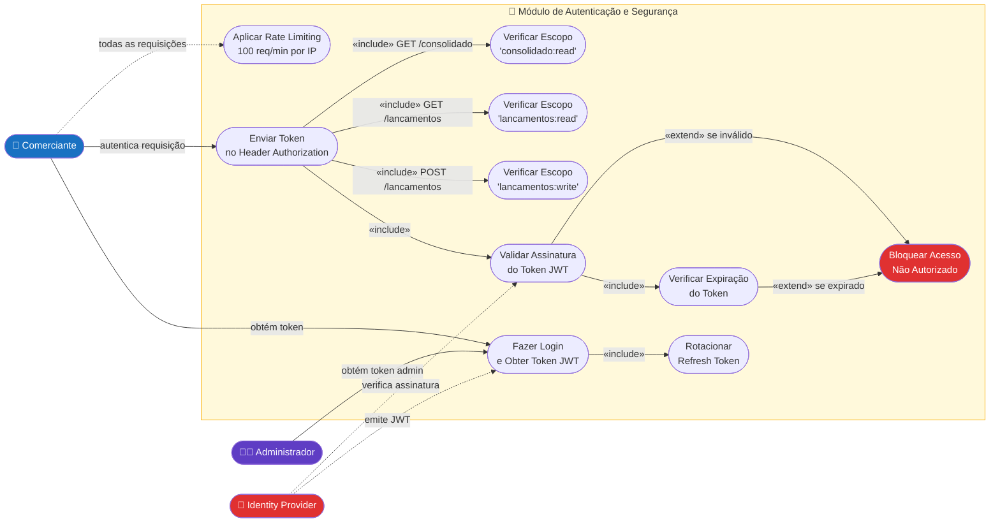
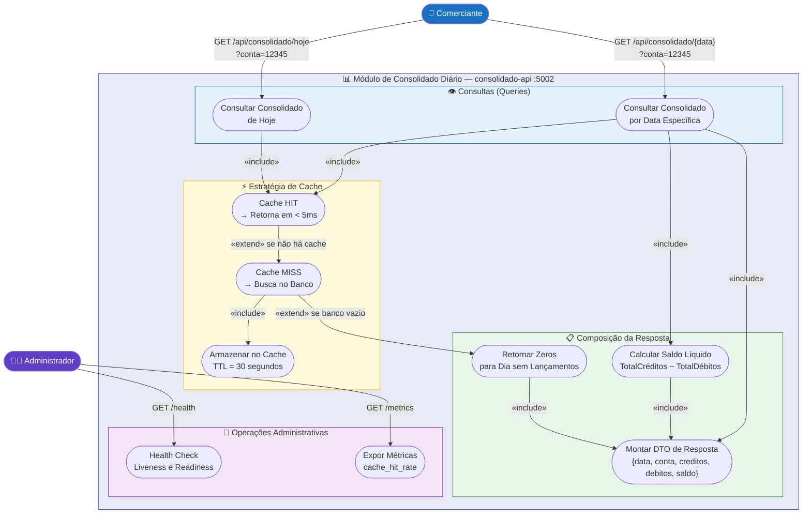
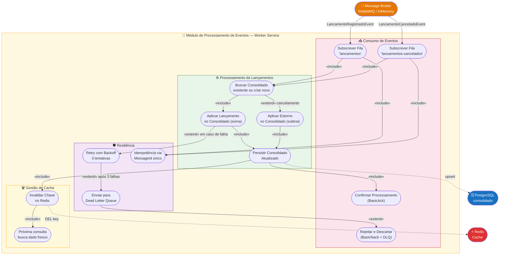
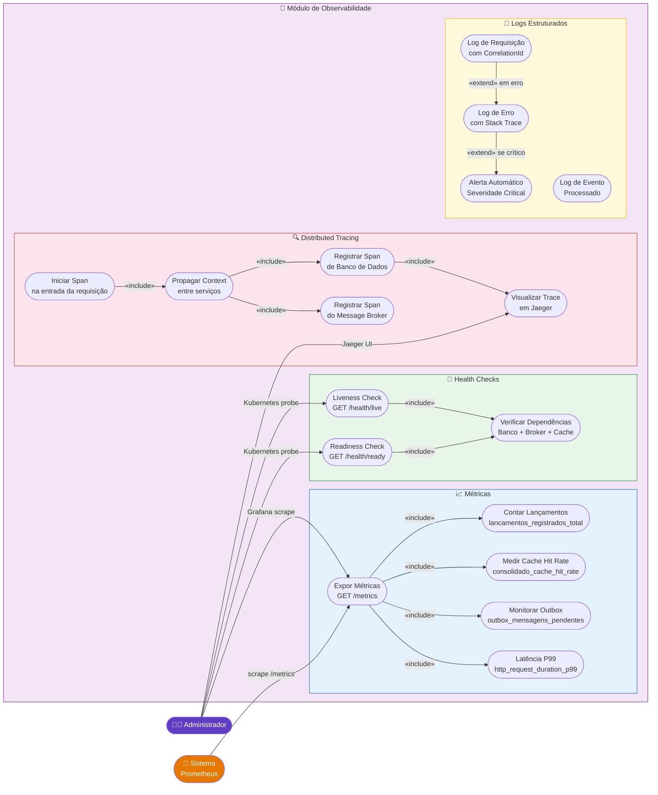
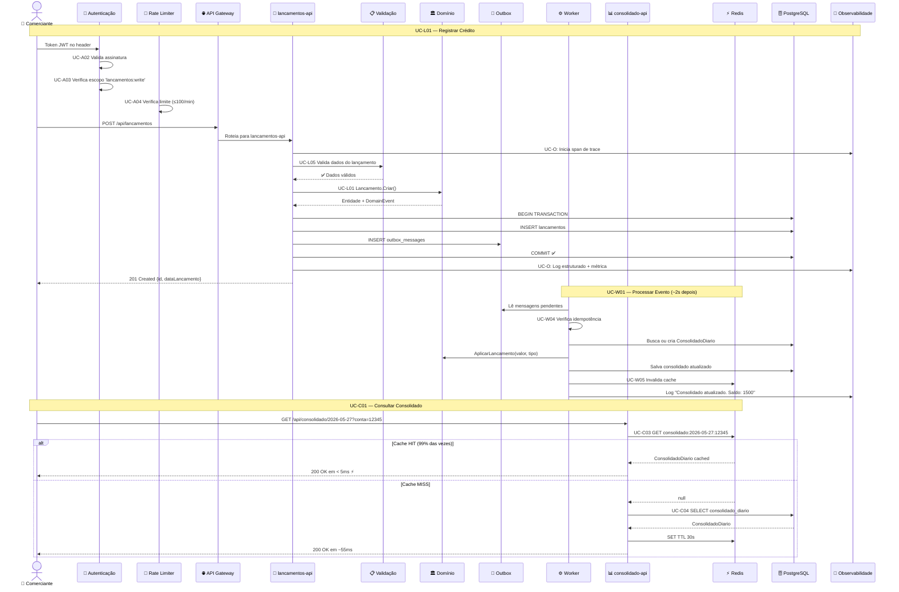
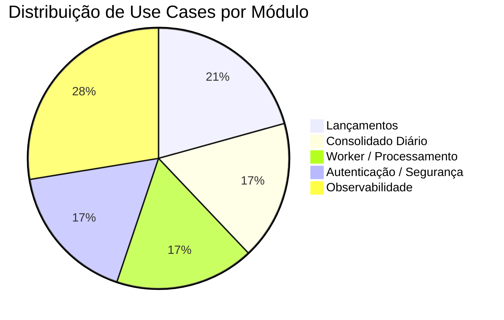

# Diagrama de Use Cases — Sistema de Controle de Fluxo de Caixa

> **Banco Carrefour · Desafio Arquiteto de Soluções · 2026**

---

## Atores do Sistema

| Ator | Tipo | Descrição |
|---|---|---|
| **Comerciante** | Primário | Usuário final que registra e consulta lançamentos financeiros |
| **Administrador** | Primário | Operador técnico que monitora e administra o sistema |
| **Identity Provider** | Secundário | Azure AD — emite e valida tokens JWT |
| **Message Broker** | Secundário | RabbitMQ/InMemoryBus — transporta eventos entre serviços |
| **Worker Service** | Secundário | Processador de eventos que atualiza o consolidado diário |

---

## 1. Visão Geral — Todos os Módulos

```mermaid
graph TB
    %% ─── Atores ───
    COM(["👤 Comerciante"])
    ADM(["👨‍💼 Administrador"])
    IDP(["🔐 Identity Provider\nAzure AD"])
    WRK(["⚙️ Worker Service\nProcessadorEventos"])

    %% ─── Sistema ───
    subgraph SISTEMA["🏢  SISTEMA FLUXO DE CAIXA"]

        subgraph MOD_AUTH["🔐 Módulo de Autenticação"]
            UC_LOGIN(["Autenticar via JWT"])
            UC_SCOPE(["Verificar Escopo\nde Autorização"])
            UC_RATE(["Controle de\nRate Limiting"])
        end

        subgraph MOD_LANC["💸 Módulo de Lançamentos"]
            UC_REG_CRED(["Registrar Lançamento\nde Crédito"])
            UC_REG_DEB(["Registrar Lançamento\nde Débito"])
            UC_CANCEL(["Cancelar Lançamento"])
            UC_LIST(["Consultar Lançamentos\npor Data"])
            UC_VAL(["Validar Dados\ndo Lançamento"])
            UC_PUB(["Publicar Evento\nde Lançamento"])
        end

        subgraph MOD_CONS["📊 Módulo de Consolidado Diário"]
            UC_CONS_DIA(["Consultar Consolidado\ndo Dia"])
            UC_CONS_HOJ(["Consultar Consolidado\nde Hoje"])
            UC_CACHE(["Estratégia\nCache-Aside Redis"])
        end

        subgraph MOD_PROC["🔄 Módulo de Processamento de Eventos"]
            UC_CONSOME(["Consumir Evento\nde Lançamento"])
            UC_ATUALIZA(["Atualizar Consolidado\nDiário"])
            UC_ESTORNO(["Aplicar Estorno\nno Consolidado"])
            UC_INVAL(["Invalidar Cache\ndo Consolidado"])
        end

        subgraph MOD_OBS["📡 Módulo de Observabilidade"]
            UC_HEALTH(["Verificar Health\nCheck"])
            UC_METRIC(["Expor Métricas\nPrometheus"])
            UC_TRACE(["Rastrear Request\n(Distributed Trace)"])
            UC_LOG(["Registrar Log\nEstruturado"])
        end

    end

    %% ─── Relacionamentos Comerciante ───
    COM --> UC_LOGIN
    COM --> UC_REG_CRED
    COM --> UC_REG_DEB
    COM --> UC_CANCEL
    COM --> UC_LIST
    COM --> UC_CONS_DIA
    COM --> UC_CONS_HOJ

    %% ─── Relacionamentos Administrador ───
    ADM --> UC_HEALTH
    ADM --> UC_METRIC
    ADM --> UC_TRACE

    %% ─── Relacionamentos Identity Provider ───
    IDP -.->|valida token| UC_LOGIN
    IDP -.->|confirma escopo| UC_SCOPE

    %% ─── Relacionamentos Worker ───
    WRK --> UC_CONSOME
    WRK --> UC_ATUALIZA
    WRK --> UC_ESTORNO
    WRK --> UC_INVAL

    %% ─── Includes internos ───
    UC_REG_CRED -->|«include»| UC_LOGIN
    UC_REG_CRED -->|«include»| UC_VAL
    UC_REG_CRED -->|«include»| UC_PUB
    UC_REG_DEB  -->|«include»| UC_LOGIN
    UC_REG_DEB  -->|«include»| UC_VAL
    UC_REG_DEB  -->|«include»| UC_PUB
    UC_CANCEL   -->|«include»| UC_LOGIN
    UC_CANCEL   -->|«include»| UC_PUB
    UC_CONS_DIA -->|«include»| UC_LOGIN
    UC_CONS_DIA -->|«include»| UC_CACHE
    UC_CONS_HOJ -->|«include»| UC_LOGIN
    UC_CONS_HOJ -->|«include»| UC_CACHE
    UC_CONSOME  -->|«include»| UC_ATUALIZA
    UC_ATUALIZA -->|«include»| UC_INVAL
    UC_ESTORNO  -->|«include»| UC_INVAL

    %% ─── Estilos ───
    style COM fill:#1971c2,color:#fff,stroke:#1864ab
    style ADM fill:#5f3dc4,color:#fff,stroke:#4c2fc4
    style IDP fill:#e03131,color:#fff,stroke:#c92a2a
    style WRK fill:#e67700,color:#fff,stroke:#d06200

    style MOD_AUTH fill:#fff9db,stroke:#fab005
    style MOD_LANC fill:#e8f5e9,stroke:#2e7d32
    style MOD_CONS fill:#e3f2fd,stroke:#1565c0
    style MOD_PROC fill:#fce4ec,stroke:#c62828
    style MOD_OBS  fill:#f3e5f5,stroke:#6a1b9a
```

---

## 2. Módulo de Autenticação e Segurança

### Casos de Uso — Autenticação

| ID | Nome | Ator | Pré-condição | Pós-condição |
|---|---|---|---|---|
| UC-A01 | Fazer Login e Obter Token JWT | Comerciante | Credenciais válidas no IdP | Token JWT emitido com TTL 15min |
| UC-A02 | Validar Token JWT | Sistema | Token presente no header | Identidade confirmada ou acesso bloqueado |
| UC-A03 | Verificar Escopo de Autorização | Sistema | Token válido | Permissão concedida ou erro 403 |
| UC-A04 | Aplicar Rate Limiting | Sistema | Requisição recebida | Processada (≤100/min) ou rejeitada (429) |
| UC-A05 | Rotacionar Refresh Token | Comerciante | Access Token expirado | Novo token emitido sem novo login |

---

## 3. Módulo de Lançamentos

```mermaid
graph TB
    COM(["👤 Comerciante"])
    WRK(["⚙️ Worker Service"])

    subgraph LANC["💸 Módulo de Lançamentos — lancamentos-api :5001"]
        direction TB

        subgraph WRITE["✍️ Operações de Escrita (Commands)"]
            UC_RC(["Registrar\nLançamento de Crédito"])
            UC_RD(["Registrar\nLançamento de Débito"])
            UC_CL(["Cancelar Lançamento\n(Soft-Delete)"])
        end

        subgraph READ["👁️ Operações de Leitura (Queries)"]
            UC_LD(["Consultar Lançamentos\npor Data"])
            UC_LI(["Consultar Lançamento\npor ID"])
        end

        subgraph RULES["📋 Regras de Domínio"]
            UC_VV(["Validar Valor\n> 0 e ≤ 10.000.000"])
            UC_VD(["Validar Data\nNão Futura"])
            UC_VDesc(["Validar Descrição\nObrigatória ≤ 255 chars"])
            UC_VT(["Validar Tipo\nDébito ou Crédito"])
            UC_VE(["Verificar Status\nAtivo antes de Cancelar"])
        end

        subgraph EVENTS["📨 Publicação de Eventos"]
            UC_PLR(["Publicar Evento\nLancamentoRegistrado"])
            UC_PLC(["Publicar Evento\nLancamentoCancelado"])
            UC_OB(["Persistir na Tabela\nOutbox (Atomicidade)"])
        end
    end

    %% Comerciante → Operações
    COM -->|"POST /api/lancamentos\n{tipo:2, valor, conta, desc}"| UC_RC
    COM -->|"POST /api/lancamentos\n{tipo:1, valor, conta, desc}"| UC_RD
    COM -->|"DELETE /api/lancamentos/{id}"| UC_CL
    COM -->|"GET /api/lancamentos/{data}"| UC_LD

    %% Includes de validação
    UC_RC -->|«include»| UC_VV
    UC_RC -->|«include»| UC_VD
    UC_RC -->|«include»| UC_VDesc
    UC_RC -->|«include»| UC_VT
    UC_RC -->|«include»| UC_PLR
    UC_RC -->|«include»| UC_OB

    UC_RD -->|«include»| UC_VV
    UC_RD -->|«include»| UC_VD
    UC_RD -->|«include»| UC_VDesc
    UC_RD -->|«include»| UC_VT
    UC_RD -->|«include»| UC_PLR
    UC_RD -->|«include»| UC_OB

    UC_CL -->|«include»| UC_VE
    UC_CL -->|«include»| UC_PLC
    UC_CL -->|«include»| UC_OB

    %% Worker consome
    UC_PLR -.->|"evento\nna fila"| WRK
    UC_PLC -.->|"evento\nna fila"| WRK

    style COM fill:#1971c2,color:#fff
    style WRK fill:#e67700,color:#fff
    style WRITE fill:#e8f5e9,stroke:#2e7d32
    style READ fill:#e3f2fd,stroke:#1565c0
    style RULES fill:#fff9db,stroke:#fab005
    style EVENTS fill:#fce4ec,stroke:#c62828
    style LANC fill:#f1f8e9,stroke:#33691e
```

### Casos de Uso — Lançamentos

| ID | Nome | Ator | Fluxo Principal | Exceções |
|---|---|---|---|---|
| UC-L01 | Registrar Crédito | Comerciante | POST com tipo=2, valor, conta, descrição → 201 Created {id} | Valor ≤ 0 → 400; Data futura → 400 |
| UC-L02 | Registrar Débito | Comerciante | POST com tipo=1, valor, conta, descrição → 201 Created {id} | Valor > 10M → 400; Descrição vazia → 400 |
| UC-L03 | Cancelar Lançamento | Comerciante | DELETE {id} → 204 No Content; evento de estorno publicado | ID inexistente → 404; Já cancelado → 400 |
| UC-L04 | Consultar por Data | Comerciante | GET {data} → lista de lançamentos com status e tipo como string | Data inválida → 400 |
| UC-L05 | Validar Dados | Sistema | Checa invariantes de domínio na entidade Lancamento.Criar() | ArgumentException propagada como 400 |
| UC-L06 | Publicar Evento | Sistema | Outbox persiste evento + lançamento na mesma transação | Falha de broker: retenta 3x; log de erro |

---

## 4. Módulo de Consolidado Diário

### Casos de Uso — Consolidado

| ID | Nome | Ator | Resposta | Observação |
|---|---|---|---|---|
| UC-C01 | Consultar Consolidado por Data | Comerciante | `{totalCreditos, totalDebitos, saldoLiquido, atualizadoEm}` | Cache HIT < 5ms; MISS ~55ms |
| UC-C02 | Consultar Consolidado de Hoje | Comerciante | Mesmo de UC-C01 para data atual | Atalho sem passar data |
| UC-C03 | Cache HIT | Sistema | Retorna do Redis em < 5ms | 99% das requisições em carga |
| UC-C04 | Cache MISS | Sistema | Busca PostgreSQL, popula Redis TTL 30s | Ocorre após invalidação |
| UC-C05 | Retornar Zeros | Sistema | `{totalCreditos:0, totalDebitos:0, saldoLiquido:0}` | Nunca retorna 404 para dias sem movimento |

---

## 5. Módulo de Processamento de Eventos (Worker)

### Casos de Uso — Worker

| ID | Nome | Trigger | Ação | Resultado |
|---|---|---|---|---|
| UC-W01 | Processar LancamentoRegistrado | Evento na fila `lancamentos` | Busca/cria ConsolidadoDiario, aplica lançamento, salva, invalida cache | Consolidado atualizado; ACK enviado |
| UC-W02 | Processar LancamentoCancelado | Evento na fila `lancamentos-cancelados` | Busca consolidado, estorna valor, salva, invalida cache | Consolidado revertido; ACK enviado |
| UC-W03 | Retry em Falha | Exception no handler | Retenta até 3 vezes com backoff exponencial | Sucesso ou envio para DLQ |
| UC-W04 | Idempotência | Evento duplicado recebido | Verifica MessageId — ignora se já processado | Sem duplicação no consolidado |
| UC-W05 | Invalidar Cache | Após salvar consolidado | Remove chave Redis `consolidado:{data}:{conta}` | Próxima consulta busca dado atualizado |

---

## 6. Módulo de Observabilidade

### Alertas Mapeados como Use Cases

| ID | Alerta | Condição | Severidade | Ação Esperada |
|---|---|---|---|---|
| UC-O01 | Latência Alta | P99 > 500ms por 2 min | Warning | Investigar cache miss rate e conexões DB |
| UC-O02 | Taxa de Erros | > 5% de 5xx em 5 min | Critical | PagerDuty; revisar logs de erro |
| UC-O03 | Outbox Acumulando | Pendentes > 500 por 5 min | Critical | Verificar broker e reiniciar worker |
| UC-O04 | Redis Indisponível | Connection refused | Warning | Fallback para PostgreSQL direto |
| UC-O05 | Serviço Down | Health check failing | Critical | Kubernetes restart automático |

---

## 7. Fluxo Completo — Visão Integrada dos Módulos

---

## 8. Matriz de Rastreabilidade — Use Cases × Requisitos

| Use Case | RF | RNF | Módulo |
|---|---|---|---|
| UC-L01 Registrar Crédito | RF-01 | RNF-04, RNF-08 | Lançamentos |
| UC-L02 Registrar Débito | RF-02 | RNF-04, RNF-08 | Lançamentos |
| UC-L03 Cancelar Lançamento | RF-04 | RNF-04 | Lançamentos |
| UC-L04 Consultar por Data | RF-03 | — | Lançamentos |
| UC-L05 Validar Dados | RF-05 | — | Lançamentos |
| UC-L06 Publicar Evento (Outbox) | — | RNF-04, RNF-07, RNF-08 | Lançamentos |
| UC-C01 Consultar Consolidado | RF-06 | RNF-02, RNF-03 | Consolidado |
| UC-C02 Consultar Hoje | RF-06 | RNF-02 | Consolidado |
| UC-C03 Cache HIT | — | RNF-02, RNF-03 | Consolidado |
| UC-C04 Cache MISS | — | RNF-02 | Consolidado |
| UC-C05 Retornar Zeros | RF-08 | — | Consolidado |
| UC-W01 Processar LancamentoRegistrado | — | RNF-01, RNF-04, RNF-05 | Worker |
| UC-W02 Processar LancamentoCancelado | — | RNF-01, RNF-04 | Worker |
| UC-W03 Retry em Falha | — | RNF-07, RNF-08 | Worker |
| UC-W04 Idempotência | — | RNF-04, RNF-07 | Worker |
| UC-A01 Login JWT | — | RNF-10 | Autenticação |
| UC-A04 Rate Limiting | — | RNF-02, RNF-10 | Autenticação |
| UC-O01~05 Health/Metrics/Traces | — | RNF-06 | Observabilidade |

---

## 9. Resumo dos Use Cases por Módulo

| Módulo | Use Cases | Atores | Criticidade |
|---|---|---|---|
| **Lançamentos** | 6 | Comerciante, Worker | Crítico |
| **Consolidado Diário** | 5 | Comerciante, Administrador | Crítico |
| **Processamento de Eventos** | 5 | Worker, Broker | Crítico |
| **Autenticação/Segurança** | 5 | Comerciante, IdP | Alta |
| **Observabilidade** | 8 | Administrador, Prometheus | Média |
| **Total** | **29** | | |

---

*Banco Carrefour · Desafio Arquiteto de Soluções · Paulo Marne · 2026*
